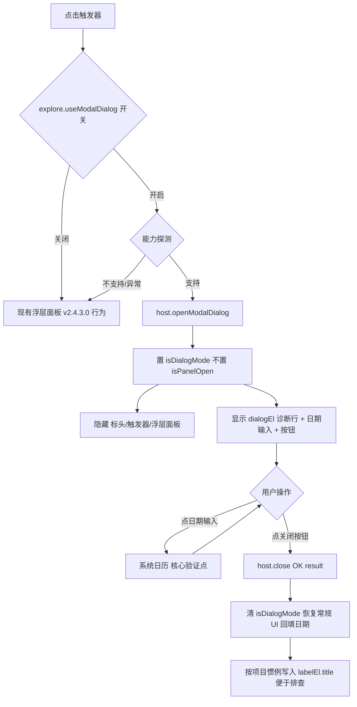

## Product Overview

对 Power BI 自定义视觉「日期区间切片器」做一次**最小可行性验证（Spike）**：确认官方 `host.openModalDialog()` 能否承载当前的下拉面板。当前下拉面板被困在视觉对象的 iframe 内（Portal / Top Layer / z-index 均无法突破 iframe 物理边界），而 `openModalDialog` 是唯一能把 DOM 渲染到宿主页面顶层的通道。

本次**不做完整迁移**，只用一个极简弹窗把关键未知数一次性测出来，据此决定后续路线：是走「弹窗化下拉」，还是退回「iframe 内浮层 + Floating UI 精修」。

## Core Features

- **核心验证点**：弹窗内放入 `input[type=date]`，验证浏览器原生系统日历能否正常弹出、可见、可点选。这是当年 v2.3.4.0 从未遇到的场景（当时弹窗内只有纯列表），是决定方案成败的唯一未知数。
- **宿主能力探测**：运行时检测 `host.openModalDialog` 是否存在、`host.hostCapabilities.allowModalDialog` 取值，不支持时自动回退现有浮层。
- **实测数据采集**：弹窗实际落点、尺寸是否受 210×240 限制、是否带半透明遮罩、close 回调是否正常、内联 CSS 变量是否生效。
- **双路径开关**：新增探索开关，开启走弹窗、关闭走现有 v2.4.3.0 浮层，验证失败可一键切回，不破坏基线。
- **现场诊断**：按项目惯例把能力探测值与回调结果写入 `labelEl.title`（hover tooltip），并在弹窗内显示诊断行，一次构建即可采全所有数据。


## Tech Stack Selection

沿用项目既有技术栈，**不引入任何新依赖**（包括不引入 `@floating-ui/dom`，那是验证失败后的备选路线）：

- 语言：TypeScript（ES6 target，`tsconfig.json` 未开 `noUnusedLocals`）
- 宿主 API：Power BI Custom Visual API 5.4.0（`powerbi-visuals-api ~5.4.0`）
- 构建：`powerbi-visuals-tools ^5.1.1` + webpack 5
- 样式：LESS（弹窗内需内联 CSS 变量，见下）
- 运行环境：Power BI sandboxed iframe；弹窗模式下 DOM 被宿主搬迁至页面顶层

## Implementation Approach

**整体策略：Spike 优先，最小爆炸半径。** 保留 v2.4.3.0 的浮层作为默认路径，弹窗路径藏在格式面板开关后面（探索期默认开，便于直接点击验证）。验证失败只需关开关，基线零风险。

**关键技术决策与权衡：**

- **为何必须 `declare module` 补全类型**：已验证 `powerbi-visuals-api` 5.4.0 的类型定义中**不含** `openModalDialog` / `DialogAction` / `VisualDialogPositionType`（`git grep` 确认当前 `src/visual.ts` 中相关关键字 0 残留，v2.3.6.0 已清理干净）。运行时可用但类型缺失，不补全无法通过 tsc。
- **为何换 GUID**：本次要改 `capabilities.json`（新增开关）。按项目既有经验，GUID 不变时 PBI Desktop 会沿用内存中的旧实例，导致「改了没生效」的误判——探索期尤其致命。GUID 改为 `DateRangeSlicer20260825005`。
- **为何必须内联 CSS 变量**：弹窗 DOM 被宿主搬到页面顶层，**不在视觉 `root` 内，拿不到 root 上的 `--drs-*` 变量**。需把 `selection` 的颜色值以内联 style 写到 dialog 容器上（沿用 v2.3.4.0 的 initialState / 内联变量思路）。
- **为何需要 `isDialogMode` 守卫**：弹窗打开期间 PBI 仍会调用 `update()`，而 `positionPanel()` 依赖 `getBoundingClientRect()` 测量——弹窗模式下 rect 已变，继续测量会算出错误的翻转/限高，且 `ensureInputsFilled()` / `deriveTriggerLabel()` 可能覆盖弹窗内容。必须在 update 入口做分支。
- **一次构建采全数据**：PBI 每次验证都要手动导入 `.pbiviz`，往返成本高。所以弹窗内除了日期输入，还要放诊断行（capability 值、尺寸、落点、回调结果），一次导入拿到全部决策数据。
- **YAGNI**：本次不迁移预设网格、不做预设/日期三者联动的弹窗版、不加搜索框。那些是验证通过后的下一步。

**性能与可靠性**：弹窗为一次性 DOM，无热路径开销；能力探测只在打开时执行一次；所有 `host` API 调用包 try-catch，失败静默回退浮层，不阻塞用户。

## Implementation Notes

- **已确认的事实（本轮 git 验证）**：当年 v2.3.4.0 的 `src/PresetDialog.ts` **从未提交进 git**（`git log --all -- "*PresetDialog.ts"` 为空），`git grep "openModalDialog"` 在全部历史提交中**只命中 CHANGELOG.md**。因此代码无法找回，需从零重写；但 CHANGELOG 中 v2.3.4.0～2.3.6.0 的记录非常详实，可还原全部关键结论。
- **API 形状需运行时校验**：下方类型声明是基于 CHANGELOG 记录与微软文档的最小草案，`VisualDialogOptions` 的字段组合（尤其 `initialState` / `onClose` 的确切形态）**必须在 PBI Desktop 中实测确认**。诊断行存在的意义正是为此——不要假定声明一定正确。
- **`isPanelOpen` 必须与弹窗状态互斥**：弹窗打开时**不要**置 `isPanelOpen = true`，否则 v2.4.3.0 新增的 `window blur` 回收监听会在宿主抢走焦点时误触发 `closePanel()`，与弹窗逻辑打架。
- **不要动 v2.4.3.0 的回收链路**：`docClickHandler` / `blurHandler` / `isInteractiveTarget` 保持原样，弹窗只是另一条分支。
- **构建必须用相对路径**：`cd visual\DateRangeSlicer; npm run package`。PowerShell 的 `cd` 遇中文路径「营收概况」会按 GBK 解析成乱码报路径不存在。
- **分支与基线**：当前在 `explore` 分支（从 tag `v2.4.3.0` 拉出）。若验证结论为「不可行」，直接弃分支回 `main` 即可，基线不受影响。
- **产物校验**：解包后对 `resources/*.pbiviz.json` 做关键词 `Contains` 匹配；检查旧逻辑是否误删要用 `-cmatch`（`-match` 不区分大小写会误命中）。

## Architecture Design

弹窗路径与现有浮层路径并列，由格式面板开关 + 宿主能力探测共同决定走哪条。



**关键约束**：弹窗内容虽是自己的 DOM，但会被宿主搬迁到页面顶层，因此 ① 拿不到 root 的 `--drs-*` 变量需内联；② 尺寸/落点由宿主控制，`RelativeToVisual` 在 Desktop 中可能偏居中（v2.3.4.1 已记录的官方硬限制）；③ 官方最小尺寸 210×240，当前内容比当年的纯列表更大。

## Directory Structure

```
c:\Users\hdc\Desktop\营收概况\
├── visual/DateRangeSlicer/
│   ├── src/
│   │   └── visual.ts          # [MODIFY] 主改动。① 顶部 declare module "powerbi-visuals-api"
│   │                          #   补全 openModalDialog/DialogAction/VisualDialogPositionType/
│   │                          #   VisualDialogOptions/hostCapabilities 最小类型（形状需运行时校验）；
│   │                          # ② 新增 dialogEl、isDialogMode、detectDialogSupport()；
│   │                          # ③ 触发器点击按「开关 + 能力探测」分流，失败静默回退现有浮层；
│   │                          # ④ update() 入口加 isDialogMode 守卫，跳过 positionPanel/
│   │                          #   ensureInputsFilled/deriveTriggerLabel 对常规 UI 的写入；
│   │                          # ⑤ host.close 回调恢复 UI 并回填日期；
│   │                          # ⑥ 弹窗容器内联 --drs-* CSS 变量（弹窗在宿主顶层拿不到 root 变量）。
│   │                          # 约束：弹窗态不得置 isPanelOpen=true，否则触发 blur 回收误关。
│   ├── capabilities.json      # [MODIFY] 新增 explore 对象及 useModalDialog bool 开关（持久化、不入主路径）。
│   ├── pbiviz.json            # [MODIFY] GUID 改为 DateRangeSlicer20260825005（capabilities 变更必须换
│   │                          #   GUID，否则 PBI Desktop 沿用旧实例看不到新格式面板）；version 升 2.5.0.0。
│   ├── style/
│   │   └── dateRangeSlicer.less # [MODIFY] 新增 .drs-dialog 相关最小样式（诊断行、测试按钮），
│   │                          #   颜色仍走内联 CSS 变量，less 仅管布局与排版。
│   └── CHANGELOG.md           # [MODIFY] 新增 2.5.0.0 条目：Spike 目的、双路径开关、能力探测、
│                              #   已知限制（落点/尺寸/遮罩为宿主控制）、待实测清单。
└── .workbuddy/skills/
    └── pbi-custom-visual-dev/
        └── SKILL.md           # [MODIFY] 追加 openModalDialog 实测结论（日历能否弹出、落点、遮罩、
                               #   尺寸、capability 值、类型形状校正），作为后续路线决策依据。
```

## Key Code Structures

以下为**待运行时校验的最小类型声明草案**——`powerbi-visuals-api` 5.4.0 未导出这些接口，不补全无法通过 tsc；但字段确切形态需在 PBI Desktop 实测确认（诊断行即为校验手段）：

```typescript
// visual.ts 顶部：补全 5.4.0 缺失的模态框 API 类型（形状需运行时校验）
declare module "powerbi-visuals-api" {
    namespace extensibility.visual {
        interface VisualDialogOptions {
            actionButtons?: number[];          // DialogAction 枚举值
            size?: { width?: number; height?: number };
            position?: { type: number; left?: number; top?: number }; // VisualDialogPositionType
            title?: string;
            initialState?: any;                // 传给弹窗的初始状态（内联样式的载体）
            onClose?: (result?: any) => void;
        }
        interface IVisualHost {
            openModalDialog?(options: VisualDialogOptions): void;
            close?(action: number, result?: any): void;
            hostCapabilities?: { allowModalDialog?: boolean };
        }
    }
}
```

配套的能力探测（返回值直接进诊断行与 `labelEl.title`）：

```typescript
/** 探测宿主是否支持模态框：任一环节缺失即回退现有浮层，不抛错 */
private detectDialogSupport(): { ok: boolean; reason: string };
```

> 注：上述签名是依据 CHANGELOG 一手记录 + 微软文档推得的最小草案。**若实测发现字段名或回调形态不符，以运行时为准并同步校正声明**——这也是本次 Spike 的产出之一。


## Agent Extensions

### Skill
- **lsp-code-analysis**
  - Purpose: 在改造 `update()` 流程前，用 LSP 的 outline / references / call hierarchy 列举 `DateRangeSlicer` 类中所有会改动 UI 状态的方法与调用点（`positionPanel` / `ensureInputsFilled` / `deriveTriggerLabel` / `updatePresetHighlight` / `syncDateInputs` / `closePanel` 等），确保 `isDialogMode` 守卫覆盖完整，不遗漏某条会在弹窗打开期间篡改常规 UI 的分支。
  - Expected outcome: 得到一份完整的「弹窗期间需屏蔽的方法清单」，避免弹窗打开时因 update 触发测量错乱或内容被覆盖。
