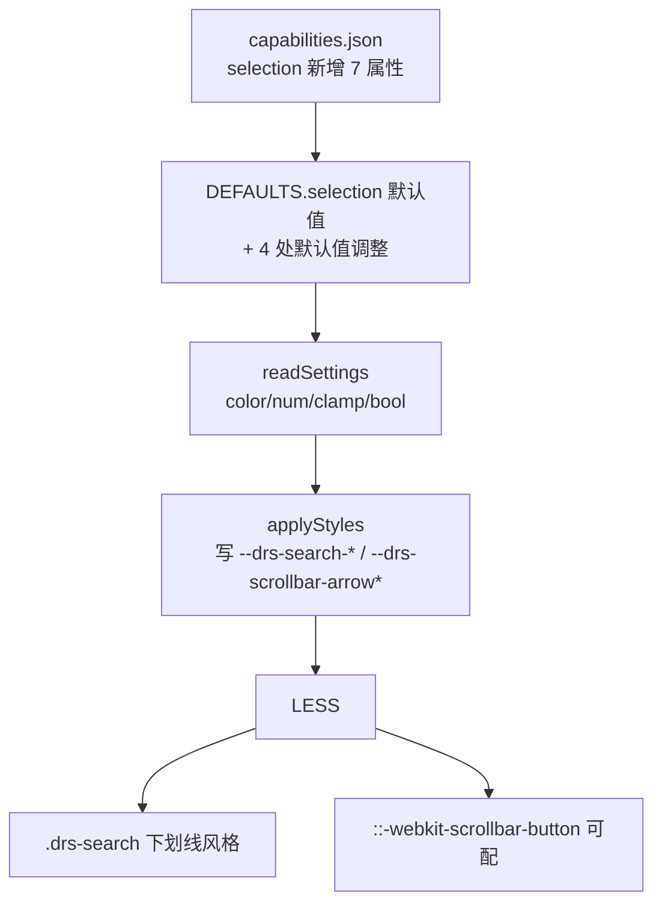

## 用户需求
用户贴图反馈后提出 5 点诉求，要求在 v2.9.0.0 基础上做 v2.10.0.0 迭代：

1. **搜索框极简下划线风格**：当前搜索框为带背景+边框的输入框样式，用户要求改为"只要有个下划线就好"——背景透明、无边框、仅底部 1px 下划线，且搜索框要吸顶（当前搜索框本就在列表外固定，已吸顶，无需改 JS）。
2. **搜索框配置项缺失**：当前搜索框复用输入框背景/边框 + 值的行高/字号，无独立配置入口，必须新增独立可配项暴露给用户。
3. **滚动条箭头颜色独立**：当前滚动条箭头被隐藏（v2.8.0.3 起 display:none），滑块色/轨道色可配但箭头不可配。用户要求箭头颜色与滑块颜色分开可配，并提供显示/隐藏开关。
4. **4 处默认值调整**（用户明确指定）：
   - 输入框下拉箭头大小：默认 `10` → **`20`**
   - 切片器标头字体颜色：默认 `#B4B2A9` → **`#FFFFFF`**
   - 下拉面板背景色：默认 `#0A1428` → **`#193653`**
   - 下拉面板与输入框间距：默认 `4` → **`0`**

## 核心功能
- 搜索框独立配置：新增 6 个属性（背景色、下划线颜色、是否显示下划线、高度、字号、边框色），LESS 改为透明底+无边框+底部下划线的极简风格。
- 滚动条箭头独立配置：新增 2 个属性（箭头颜色、是否显示箭头），LESS 滚动条箭头由隐藏改为可配显示+独立颜色。
- 4 处默认值调整并贯通 DEFAULTS。
- 换 GUID `011→012`、版本 `2.9.0.0→2.10.0.0`。


## 技术栈
- Power BI Custom Visuals API 5.4.0
- TypeScript + LESS + Webpack（无前端框架）
- 构建：`cmd /d /c "chcp 65001 >nul & cd /d c:\Users\hdc\Desktop\营收概况\visual\DateRangeSlicer && npm run package"`

## 实现方案

### 总体策略
沿用既有「capabilities 声明 → DEFAULTS → readSettings(color/num/clamp/bool helper) → applyStyles(setProperty 写 CSS 变量) → LESS var() 引用」链路。本次新增 7 个可配属性（搜索框 6 + 滚动条箭头 2，其中 searchBorderColor 为可选补充），贯通五处链路；同时调整 4 处默认值。JS 交互逻辑完全不动。

### 关键修改点

**1. capabilities.json（selection 对象）新增 7 属性**

颜色类（fill.solid.color）：
- `searchBackground` 搜索框背景色（默认 transparent）
- `searchBorderColor` 搜索框边框色（默认 #2C4A6B）
- `searchUnderlineColor` 搜索框下划线颜色（默认 #2C4A6B）
- `scrollbarArrowColor` 滚动条箭头颜色（默认 #2C4A6B，与滑块分开）

尺寸类（numeric）：
- `searchHeight` 搜索框高度（默认 24，范围 16-60）
- `searchFontSize` 搜索框字号（默认 11，范围 8-20）

布尔类（bool）：
- `searchShowUnderline` 搜索框显示下划线（默认 true）
- `scrollbarShowArrow` 滚动条显示箭头（默认 false，延续隐藏行为但可开启）

**2. DEFAULTS 调整**

新增（selection）：
```
searchBackground: "transparent",
searchBorderColor: "#2C4A6B",
searchUnderlineColor: "#2C4A6B",
searchShowUnderline: true,
searchHeight: 24,
searchFontSize: 11,
scrollbarArrowColor: "#2C4A6B",
scrollbarShowArrow: false,
```
修改默认值（4 处）：
- `arrowSize: 10 → 20`（selection）
- `header.fontColor: "#B4B2A9" → "#FFFFFF"`（DEFAULTS.header）
- `listBackground: "#0A1428" → "#193653"`（selection）
- `panelOffset: 4 → 0`（selection）

**3. readSettings 贯通**
颜色用 `color(s.X, DEFAULTS.selection.X)`；数值用 `clamp(s.X, lo, hi, DEFAULTS.selection.X)`（searchHeight 16-60、searchFontSize 8-20）；bool 用 `bool(s.X, DEFAULTS.selection.X)`。header.fontColor 沿用既有 `color(h.fontColor, DEFAULTS.header.fontColor)` 自动生效。

**4. applyStyles 写 CSS 变量**
新增：
- `--drs-search-bg`（searchBackground）
- `--drs-search-border`（searchBorderColor）
- `--drs-search-underline`（searchUnderlineColor）
- `--drs-search-underline-on`（searchShowUnderline ? "1px" : "0"）
- `--drs-search-h`（searchHeight + "px"）
- `--drs-search-fs`（searchFontSize + "px"）
- `--drs-scrollbar-arrow`（scrollbarArrowColor）
- `--drs-scrollbar-arrow-on`（scrollbarShowArrow ? "auto" : "none"）

**5. getFormattingModel 分组扩充**

- 新建「搜索框」组（置于「值」组之前，因搜索框仅列表模式可见）：背景色、下划线颜色、显示下划线(bool)、高度、字号、边框色
- 滚动条组追加：箭头颜色、显示箭头(bool)

**6. LESS 修改**

`.drs-search` 改为极简下划线风格：
```
background: var(--drs-search-bg, transparent);
border: none;
border-bottom: var(--drs-search-underline-on, 1px) solid var(--drs-search-underline, #2C4A6B);
border-radius: 0;
height: var(--drs-search-h, 24px);
font-size: var(--drs-search-fs, 11px);
padding: 0 8px;  /* 保留左右内边距，文字不与边缘贴死 */
color: var(--drs-list-fg, #FFFFFF);
```
（注：原复用 `--drs-bg`/`--drs-border-width`/`--drs-border`/`--drs-radius` 改为独立 token）

滚动条按钮改为可配：
```
.drs-panel::-webkit-scrollbar-button,
.drs-list::-webkit-scrollbar-button,
.drs-panel.drs-panel-inline::-webkit-scrollbar-button {
    display: var(--drs-scrollbar-arrow-on, none);
    width: var(--drs-scrollbar-w, 8px);
    height: var(--drs-scrollbar-w, 8px);
    background: var(--drs-scrollbar-arrow, #2C4A6B);
}
```
原 `display:none; width:0; height:0` 移除，改由变量驱动。Webkit 箭头色由 background 控制，仅 Windows 部分主题显示（Firefox 无独立箭头 API，箭头随 thumb，备注说明）。

**7. pbiviz.json**
guid `DateRangeSlicer20260825011`→`DateRangeSlicer20260825012`；version `2.9.0.0`→`2.10.0.0`；displayName `日期区间切片器 v2.10-搜索框独立配置`；description 概述搜索框极简下划线 + 滚动条箭头独立 + 默认值调整。

### 性能与兼容性
- CSS 变量零运行时开销，applyStyles 仅 update 时调用一次。
- 所有新属性有 DEFAULTS 回落，旧报表兼容。
- GUID 变更后旧视觉实例需删除画布旧视觉重新导入（capabilities 变更硬性要求）。
- 搜索框吸顶：当前搜索框在 `.drs-list` 外、面板 `overflow:hidden` 内部滚动，搜索框本就固定不随列表滚走，无需改 JS。

### 产物校验
解包 `dist/DateRangeSlicer20260825012.2.10.0.0.pbiviz`（zip 格式），对 `resources/DateRangeSlicer20260825012.pbiviz.json` 关键词校验：
- 7 个新属性在 capabilities
- `--drs-search-bg/--drs-search-border/--drs-search-underline/--drs-search-underline-on/--drs-search-h/--drs-search-fs/--drs-scrollbar-arrow/--drs-scrollbar-arrow-on` 全部写入 JS
- `.drs-search` 使用 `var(--drs-search-bg)` 且 `border-bottom` 下划线、`border:none`
- `::-webkit-scrollbar-button` 的 `display` 由 `var(--drs-scrollbar-arrow-on)` 控制
- 4 处默认值：arrowSize 20、header.fontColor #FFFFFF、listBackground #193653、panelOffset 0
- 版本 `2.10.0.0`、GUID `012`

## 架构设计


## 目录结构
```
visual/DateRangeSlicer/
├── capabilities.json              # [MODIFY] selection 新增 7 属性
├── pbiviz.json                    # [MODIFY] guid 011→012、version→2.10.0.0、displayName/description
├── src/visual.ts                  # [MODIFY] DEFAULTS 加 7 属性+改 4 默认值；readSettings 贯通；applyStyles 写 8 变量；getFormattingModel 新增搜索框组 6 项 + 滚动条组 2 项
├── style/dateRangeSlicer.less     # [MODIFY] .drs-search 改下划线风格+独立 token；滚动条 button 改可配+箭头色变量
├── CHANGELOG.md                   # [MODIFY] 顶部插入 2.10.0.0 条目
└── dist/                          # [MODIFY] 新增 012.2.10.0.0.pbiviz，清理旧 2.9.0.0 产物
```

