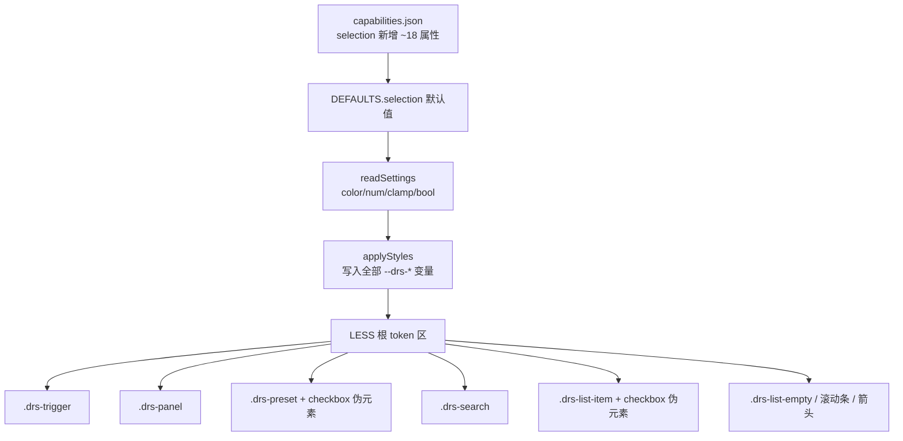

## 用户需求
用户要求 DateRangeSlicer 两种模式（预设区间 / 值列表）的**全部 UI 维度都可配置**，明确强调"不要因为默认就不允许用户配置"。触发器默认背景 `#193653`、文字 `#FFFFFF`，其余颜色按深蓝暗色主题补齐默认值但全部暴露为格式面板入口。同时将预设模式选中态统一为列表模式的 checkbox 风格（勾选框 + 文字高亮），并一次性消除之前零散 patch 遗留的视觉不一致。

## 核心功能
1. **全局可配化**：将当前所有硬编码的 UI 维度（颜色、行高、字号、内边距、间距、checkbox 尺寸/圆角、箭头大小、滚动条宽度、占位符色、空状态色、面板偏移等约 18 项）全部暴露为格式面板配置项，零硬编码死角。
2. **设计 token 化**：在 LESS 根变量区建立统一 token（行高、字号、内边距、间距、checkbox、面板偏移、箭头、滚动条等），所有选择器引用变量，删除散落字面量。
3. **预设选中态 checkbox 化**：预设项加左侧勾选框伪元素，选中态改为"勾选框填强调色 + 白色对勾 + 文字高亮"，与列表模式完全一致，去掉整行蓝框/半透明蓝底/整行加粗。
4. **触发器默认配色更新**：背景 `#193653`、文字 `#FFFFFF`，其余颜色按深蓝暗色主题补齐默认值但均可改。
5. **换 GUID 与版本**：因 capabilities 新增属性，GUID `010→011`、版本 `2.8.0.4→2.9.0.0`。


## 技术栈
- Power BI Custom Visuals API 5.4.0
- TypeScript + LESS + Webpack（无前端框架）
- 构建：`cmd /d /c "chcp 65001 >nul & cd /d c:\Users\hdc\Desktop\营收概况\visual\DateRangeSlicer && npm run package"`

## 实现方案

### 总体策略
沿用既有「capabilities 声明 → DEFAULTS → readSettings(color/num/clamp helper) → applyStyles(setProperty 写 CSS 变量) → LESS var() 引用」链路。本次为一次**全局可配化大改**：把两套模式统一成同一套 token 驱动的"可选择行"视觉语言，并把所有硬编码 UI 维度暴露为格式面板入口。JS 交互逻辑（selectPreset/toggleListItem/筛选下发）完全不动。

### 关键修改点

**1. capabilities.json（selection 对象）新增约 18 个属性**

颜色类（fill.solid.color）：
- `presetBackground` 预设项默认背景色
- `presetHoverBackground` 预设项悬浮背景色
- `placeholderColor` 搜索框占位符色
- `emptyTextColor` 空状态提示文字色

尺寸类（numeric）：
- `itemHeight` 行高（预设/列表/搜索框共享，默认 24）
- `itemFontSize` 行字号（共享，默认 11）
- `itemPaddingX` 行水平内边距（共享，默认 8）
- `triggerHeight` 触发器高度（默认 30）
- `triggerPaddingX` 触发器水平内边距（默认 8）
- `panelPaddingY` 面板上下内边距（默认 10）
- `panelPaddingX` 面板左右内边距（默认 0）
- `panelOffset` 面板与触发器间距（默认 4）
- `checkSize` 勾选框尺寸（默认 14）
- `checkRadius` 勾选框圆角（默认 2）
- `arrowSize` 下拉箭头大小（默认 10）
- `scrollbarWidth` 滚动条宽度（默认 8）
- `headerGap` 标头与触发器间距（默认 4 top / 6 left 用同值）
- `activeBold` 选中态加粗（bool，默认 true）

**2. DEFAULTS.selection 同步全部新属性**
颜色默认值：backgroundColor `#193653`（用户指定，原#142436）、triggerTextColor `#FFFFFF`（用户指定）、borderColor `#2C4A6B`、accentColor `#378ADD`、listBackground `#0A1428`、listText `#FFFFFF`、listHoverText `#B4B2A9`、listHoverBackground `transparent`、listActiveText `#378ADD`、listActiveBackground `transparent`、presetBackground `rgba(255,255,255,0.03)`、presetHoverBackground `rgba(255,255,255,0.05)`、scrollbarTrackColor `#0A1428`、scrollbarThumbColor `#2C4A6B`、placeholderColor `rgba(255,255,255,0.45)`、emptyTextColor `rgba(255,255,255,0.5)`。
尺寸默认值：borderWidth 1、borderRadius 3、triggerFontSize 12、listGap 2、itemHeight 24、itemFontSize 11、itemPaddingX 8、triggerHeight 30、triggerPaddingX 8、panelPaddingY 10、panelPaddingX 0、panelOffset 4、checkSize 14、checkRadius 2、arrowSize 10、scrollbarWidth 8、headerGap 4、activeBold true。

**3. readSettings 逐属性贯通**
对颜色用 `color(s.X, DEFAULTS.selection.X)`；对数值用 `clamp(s.X, lo, hi, DEFAULTS.selection.X)`（triggerFontSize/itemHeight 等设合理 min/max，如 itemHeight 16-48、itemFontSize 8-20）；bool 用 `bool(s.activeBold, DEFAULTS.selection.activeBold)`。

**4. applyStyles 写全部 CSS 变量**
`--drs-bg`(backgroundColor) `--drs-fg`(triggerTextColor) `--drs-trigger-fs` `--drs-border` `--drs-accent` `--drs-radius` `--drs-border-width` `--drs-list-bg` `--drs-list-fg` `--drs-list-hover-fg` `--drs-list-hover-bg` `--drs-list-active-fg` `--drs-list-active-bg` `--drs-scrollbar-track` `--drs-scrollbar-thumb` `--drs-list-gap`
新增：`--drs-item-h` `--drs-row-fs` `--drs-row-pad-x` `--drs-preset-bg` `--drs-preset-hover-bg` `--drs-trigger-h` `--drs-trigger-pad-x` `--drs-panel-pad-y` `--drs-panel-pad-x` `--drs-panel-offset` `--drs-check-size` `--drs-check-radius` `--drs-arrow-size` `--drs-scrollbar-w` `--drs-placeholder` `--drs-empty-fg` `--drs-active-bold`（bool 转 1/0 或 "bold"/"normal"）。

**5. getFormattingModel 扩充 4 组 slices**
- 触发器组：背景色、文字色、文字大小、高度(triggerHeight)、水平内边距(triggerPaddingX)、边框色、边框粗细、圆角、下拉箭头大小(arrowSize)
- 面板组：面板背景色、文字色、上下内边距(panelPaddingY)、左右内边距(panelPaddingX)、与触发器间距(panelOffset)
- 列表项组：强调色、预设项默认背景(presetBackground)、预设项悬浮背景(presetHoverBackground)、悬浮文字色、悬浮背景色、选中文字色、选中背景色、选中加粗(activeBold)、行高(itemHeight)、字号(itemFontSize)、水平内边距(itemPaddingX)、行间距(listGap)、勾选框尺寸(checkSize)、勾选框圆角(checkRadius)、占位符色(placeholderColor)、空状态色(emptyTextColor)
- 滚动条组：轨道色、滑块色、宽度(scrollbarWidth)

**6. LESS token 化重写（style/dateRangeSlicer.less）**
根变量区 `.dateRangeSlicer` 新增全部 `--drs-*` token 及 fallback。
- `.drs-trigger`：height `var(--drs-trigger-h,30px)`、padding `0 var(--drs-trigger-pad-x,8px)`、arrow font-size `var(--drs-arrow-size,10px)`
- `.drs-panel`：padding `var(--drs-panel-pad-y,10px) var(--drs-panel-pad-x,0)`、top `calc(100% + var(--drs-panel-offset,4px))`、up 状态 bottom 同 offset、scrollbar width `var(--drs-scrollbar-w,8px)`
- `.drs-preset-grid`：gap `var(--drs-list-gap,2px)`
- `.drs-preset`：height `var(--drs-item-h,24px)`、padding `0 var(--drs-row-pad-x,8px) 0 28px`、font-size `var(--drs-row-fs,11px)`、background `var(--drs-preset-bg,rgba(255,255,255,0.03))`、position relative；hover background `var(--drs-preset-hover-bg)`；active 去整行 border/font-weight:600/半透明蓝底，改 `color:var(--drs-list-active-fg)` 且 `font-weight: var(--drs-active-bold,600)`；新增 `::before` 勾选框（width/height `var(--drs-check-size,14px)`、border-radius `var(--drs-check-radius,2px)`、border `1px solid var(--drs-border)`、background `var(--drs-bg)`），`active::before` 填 accent，`active::after` 白对勾（尺寸随 checkSize 等比）
- `.drs-search`：height `var(--drs-item-h,24px)`、font-size `var(--drs-row-fs,11px)`、placeholder color `var(--drs-placeholder)`
- `.drs-list-item`：height/font-size/padding 改用 token；`::before` checkbox 尺寸/圆角用 `--drs-check-*`；`active` font-weight `var(--drs-active-bold,600)`
- `.drs-list-empty`：color `var(--drs-empty-fg)`、font-size `var(--drs-row-fs,11px)`
- `.drs-layout-top` gap 用 `var(--drs-header-gap,4px)`、`.drs-layout-left` gap 用同值

**7. pbiviz.json**
guid `DateRangeSlicer20260825010`→`DateRangeSlicer20260825011`；version `2.8.0.4`→`2.9.0.0`；displayName `日期区间切片器 v2.9-全局UI可配置`；description 概述本次全局可配化 + checkbox 统一。

### 性能与兼容性
- CSS 变量 + calc 零运行时开销，applyStyles 仅 update 调用一次。
- 所有新属性均有 DEFAULTS 回落，旧报表缺失时回落默认，兼容无碍。
- GUID 变更后旧视觉实例需删除画布旧视觉重新导入（capabilities 变更硬性要求）。
- checkbox 伪元素纯 CSS 绘制，不改动 DOM、不影响筛选逻辑。

### 产物校验
解包 `dist/DateRangeSlicer20260825011.2.9.0.0.pbiviz`，对 `resources/DateRangeSlicer20260825011.pbiviz.json` 关键词校验：所有新 `--drs-*` 变量写入 JS、所有新属性在 capabilities、`.drs-preset.active` 无 `border:1px solid` 整行边框/无 `font-weight:600` 硬编码/无 `rgba(55,138,221,0.18)`、checkbox 伪元素存在、版本 `2.9.0.0`、GUID `011`。

## 架构设计



## 目录结构
```
visual/DateRangeSlicer/
├── capabilities.json              # [MODIFY] selection 对象新增 ~18 个可配属性
├── pbiviz.json                    # [MODIFY] guid 010→011、version→2.9.0.0、displayName/description
├── src/visual.ts                  # [MODIFY] DEFAULTS 加全部新属性；readSettings 贯通；applyStyles 写全部变量；getFormattingModel 4 组扩充 slices
├── style/dateRangeSlicer.less     # [MODIFY] 根变量区 token 化；.drs-preset 重写+checkbox；.drs-trigger/.drs-panel/.drs-search/.drs-list-item/.drs-list-empty/箭头/滚动条改用 token
├── CHANGELOG.md                   # [MODIFY] 顶部插入 2.9.0.0 条目
└── dist/                          # [MODIFY] 新增 011.2.9.0.0.pbiviz，清理旧 2.8.0.4 产物
```

