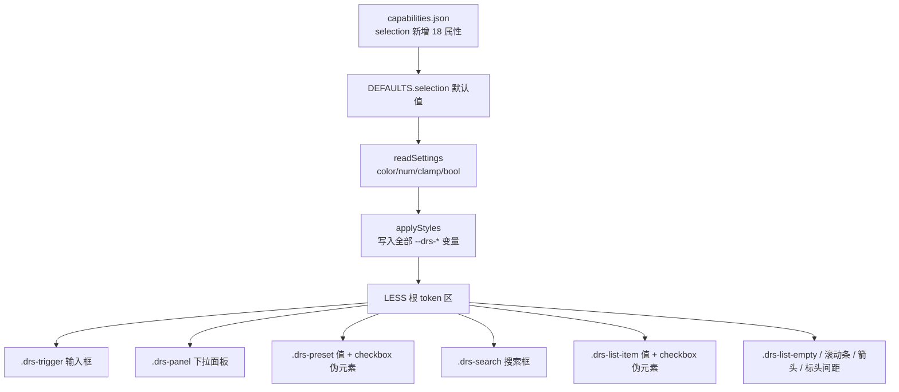

## 用户需求
用户要求 DateRangeSlicer（日期区间切片器）双模式（预设区间 / 值列表）的**全部 UI 维度都可配置**，明确强调"不要因为默认就不允许用户配置"。触发器默认背景 `#193653`、文字 `#FFFFFF`，其余颜色按深蓝暗色主题补齐默认值但全部暴露为格式面板入口。同时将预设模式选中态统一为列表模式的 checkbox 风格（勾选框 + 文字高亮），一次性消除之前零散 patch 遗留的视觉不一致。

## 产品概述
对切片器视觉对象做一次"全局可配化"大改：把预设与列表两套模式统一成同一套 token 驱动的"可选择行"视觉语言，并将所有硬编码的 UI 维度（颜色、行高、字号、内边距、间距、勾选框尺寸/圆角、箭头大小、滚动条宽度、占位符色、空状态色、面板偏移、标头间距等）暴露为格式面板配置项，零硬编码死角。格式面板按专业区域分组：切片器模式 / 切片器标头 / 输入框 / 下拉面板 / 值 / 滚动条。

## 核心功能
1. **全局可配化**：capabilities 新增 18 个可配属性（颜色 4 项、尺寸 13 项、布尔 1 项），链路贯通 DEFAULTS → readSettings → applyStyles → 格式面板，所有现有硬编码字面量改为 CSS 变量驱动。
2. **设计 token 化**：LESS 根变量区建立统一 token（行高、字号、内边距、间距、勾选框、面板偏移、箭头、滚动条、标头间距等），所有选择器引用变量，删除散落字面量。
3. **预设选中态 checkbox 化**：预设项加左侧勾选框伪元素，选中态改为"勾选框填强调色 + 白色对勾 + 文字高亮"，与"值"模式完全一致，去掉整行蓝框 / 半透明蓝底 / 整行加粗。
4. **输入框默认配色更新**：背景 `#193653`、文字 `#FFFFFF`，其余颜色按深蓝暗色主题补齐默认值但均可改。
5. **专业分组命名**：触发器 → "输入框"，项（行）→ "值"，其余分组（模式、标头、下拉面板、滚动条）不变。
6. **换 GUID 与版本**：因 capabilities 新增属性，GUID `010→011`、版本 `2.8.0.4→2.9.0.0`。


## 技术栈
- Power BI Custom Visuals API 5.4.0
- TypeScript + LESS + Webpack（无前端框架）
- 构建：`cmd /d /c "chcp 65001 >nul & cd /d c:\Users\hdc\Desktop\营收概况\visual\DateRangeSlicer && npm run package"`

## 实现方案

### 总体策略
沿用既有「capabilities 声明 → DEFAULTS → readSettings(color/num/clamp/bool helper) → applyStyles(setProperty 写 CSS 变量) → LESS var() 引用」链路。本次为一次全局可配化大改：把两套模式统一成同一套 token 驱动的"可选择行"视觉语言，并把所有硬编码 UI 维度暴露为格式面板入口。JS 交互逻辑（selectPreset / toggleListItem / 白名单 / 筛选下发 / 面板回收）完全不动。

### 关键修改点

**1. capabilities.json（selection 对象）新增 18 个属性 + 改 2 个默认**

颜色类（fill.solid.color）：`presetBackground`、`presetHoverBackground`、`placeholderColor`、`emptyTextColor`
尺寸类（numeric）：`itemHeight`、`itemFontSize`、`itemPaddingX`、`triggerHeight`、`triggerPaddingX`、`panelPaddingY`、`panelPaddingX`、`panelOffset`、`checkSize`、`checkRadius`、`arrowSize`、`scrollbarWidth`、`headerGap`
布尔类（bool）：`activeBold`
同时改 `backgroundColor` 默认 `#142436`→`#193653`、`triggerTextColor` 默认→`#FFFFFF`（默认值在 DEFAULTS 改，capabilities 仅声明类型）。

**2. DEFAULTS.selection 同步全部新属性**
颜色：`backgroundColor #193653`、`triggerTextColor #FFFFFF`、`borderColor #2C4A6B`、`accentColor #378ADD`、`listBackground #0A1428`、`listText #FFFFFF`、`listHoverText #B4B2A9`、`listHoverBackground transparent`、`listActiveText #378ADD`、`listActiveBackground transparent`、`presetBackground rgba(255,255,255,0.03)`、`presetHoverBackground rgba(255,255,255,0.05)`、`scrollbarTrackColor #0A1428`、`scrollbarThumbColor #2C4A6B`、`placeholderColor rgba(255,255,255,0.45)`、`emptyTextColor rgba(255,255,255,0.5)`
尺寸：`borderWidth 1`、`borderRadius 3`、`triggerFontSize 12`、`listGap 2`、`itemHeight 24`、`itemFontSize 11`、`itemPaddingX 8`、`triggerHeight 30`、`triggerPaddingX 8`、`panelPaddingY 10`、`panelPaddingX 0`、`panelOffset 4`、`checkSize 14`、`checkRadius 2`、`arrowSize 10`、`scrollbarWidth 8`、`headerGap 4`、`activeBold true`

**3. readSettings 逐属性贯通**
颜色用 `color(s.X, DEFAULTS.selection.X)`；数值用 `clamp(s.X, lo, hi, DEFAULTS.selection.X)`（itemHeight 16-48、itemFontSize 8-20、itemPaddingX 0-24、triggerHeight 16-60、triggerPaddingX 0-24、panelPaddingY 0-40、panelPaddingX 0-40、panelOffset 0-20、checkSize 10-24、checkRadius 0-6、arrowSize 6-20、scrollbarWidth 4-16、headerGap 0-20）；bool 用 `bool(s.activeBold, DEFAULTS.selection.activeBold)`。

**4. applyStyles 写全部 CSS 变量**
既有变量保留；新增：`--drs-item-h`、`--drs-row-fs`、`--drs-row-pad-x`、`--drs-preset-bg`、`--drs-preset-hover-bg`、`--drs-trigger-h`、`--drs-trigger-pad-x`、`--drs-panel-pad-y`、`--drs-panel-pad-x`、`--drs-panel-offset`、`--drs-check-size`、`--drs-check-radius`、`--drs-arrow-size`、`--drs-scrollbar-w`、`--drs-placeholder`、`--drs-empty-fg`、`--drs-active-bold`（true→`bold`、false→`normal`）、`--drs-header-gap`。

**5. getFormattingModel 按专业分组重排**
- **切片器模式** card（mode）：模式枚举（preset/list）
- **切片器标头** card（header）：既有属性 + 新增 `headerGap`（标头与输入框间距）
- **输入框** card（selection，displayName "输入框"）：背景色、文字色、文字大小、高度、水平内边距、边框颜色、边框粗细、圆角、下拉箭头大小
- **下拉面板** group（selection 内）：背景色、文字色、上下内边距、左右内边距、与输入框间距
- **值** group（selection 内）：强调色、预设项默认背景、预设项悬浮背景、悬浮文字色、悬浮背景色、选中文字色、选中背景色、选中加粗、行高、字号、水平内边距、行间距、勾选框尺寸、勾选框圆角、搜索框占位符色、空状态文字色
- **滚动条** group（selection 内）：轨道色、滑块色、宽度

原 selectionCard 4 组（触发器/面板/列表项/滚动条）改名为 输入框/下拉面板/值/滚动条，措辞"触发器"→"输入框"、"列表项"→"值"。

**6. LESS token 化重写（style/dateRangeSlicer.less）**
根变量区 `.dateRangeSlicer` 新增全部 `--drs-*` token 及 fallback：
- `.drs-trigger`：height `var(--drs-trigger-h,30px)`、padding `0 var(--drs-trigger-pad-x,8px)`、arrow font-size `var(--drs-arrow-size,10px)`
- `.drs-panel`：padding `var(--drs-panel-pad-y,10px) var(--drs-panel-pad-x,0)`、top `calc(100% + var(--drs-panel-offset,4px))`、up 状态 bottom 同 offset、scrollbar width `var(--drs-scrollbar-w,8px)`
- `.drs-preset-grid`：gap `var(--drs-list-gap,2px)`
- `.drs-preset`：height `var(--drs-item-h,24px)`、padding `0 var(--drs-row-pad-x,8px) 0 28px`、font-size `var(--drs-row-fs,11px)`、background `var(--drs-preset-bg,rgba(255,255,255,0.03))`、position relative；hover background `var(--drs-preset-hover-bg)`；active 去整行 border / `font-weight:600` / 半透明蓝底，改 `color:var(--drs-list-active-fg)` + `font-weight:var(--drs-active-bold,600)`；新增 `::before` 勾选框（width/height `var(--drs-check-size,14px)`、border-radius `var(--drs-check-radius,2px)`、border `1px solid var(--drs-border)`、background `var(--drs-bg)`）、`active::before` 填 accent、`active::after` 白对勾（尺寸随 checkSize 等比，left 按 checkSize 推算）
- `.drs-search`：height `var(--drs-item-h,24px)`、font-size `var(--drs-row-fs,11px)`、placeholder color `var(--drs-placeholder)`
- `.drs-list-item`：height/font-size/padding 改用 token；`::before` checkbox 尺寸/圆角用 `--drs-check-*`；active `font-weight:var(--drs-active-bold,600)`
- `.drs-list-empty`：color `var(--drs-empty-fg)`、font-size `var(--drs-row-fs,11px)`
- `.drs-layout-top`/`.drs-layout-left` gap 用 `var(--drs-header-gap,4px)`（原 left 6px 统一）

**7. pbiviz.json**
guid `DateRangeSlicer20260825010`→`DateRangeSlicer20260825011`；version `2.8.0.4`→`2.9.0.0`；displayName `日期区间切片器 v2.9-全局UI可配置`；description 概述全局可配化 + checkbox 统一 + 输入框/值命名。

### 性能与兼容性
- CSS 变量 + calc 零运行时开销，applyStyles 仅 update 调用一次。
- 所有新属性均有 DEFAULTS 回落，旧报表缺失时回落默认，兼容无碍。
- GUID 变更后旧视觉实例需删除画布旧视觉重新导入（capabilities 变更硬性要求）。
- checkbox 伪元素纯 CSS 绘制，不改动 DOM、不影响筛选逻辑。

### 产物校验
解包 `dist/DateRangeSlicer20260825011.2.9.0.0.pbiviz`，对 `resources/DateRangeSlicer20260825011.pbiviz.json` 关键词校验：所有新 `--drs-*` 变量写入 JS、所有 18 个新属性在 capabilities、`.drs-preset.active` 无 `border:1px solid` 整行边框 / 无 `font-weight:600` 硬编码 / 无 `rgba(55,138,221,0.18)`、checkbox 伪元素存在、版本 `2.9.0.0`、GUID `011`。

## 架构设计



## 目录结构

```
visual/DateRangeSlicer/
├── capabilities.json              # [MODIFY] selection 新增 18 属性；改 backgroundColor/triggerTextColor 默认
├── pbiviz.json                    # [MODIFY] guid 010→011、version→2.9.0.0、displayName/description
├── src/visual.ts                  # [MODIFY] DEFAULTS 加全部新属性；readSettings 贯通；applyStyles 写全部变量；getFormattingModel 重排为 模式/标头/输入框/下拉面板/值/滚动条
├── style/dateRangeSlicer.less     # [MODIFY] 根变量区 token 化；.drs-preset 重写+checkbox；.drs-trigger/.drs-panel/.drs-search/.drs-list-item/.drs-list-empty/箭头/滚动条/布局 gap 改用 token
├── CHANGELOG.md                   # [MODIFY] 顶部插入 2.9.0.0 条目
└── dist/                          # [MODIFY] 新增 011.2.9.0.0.pbiviz，清理旧 2.8.0.4 产物
```

