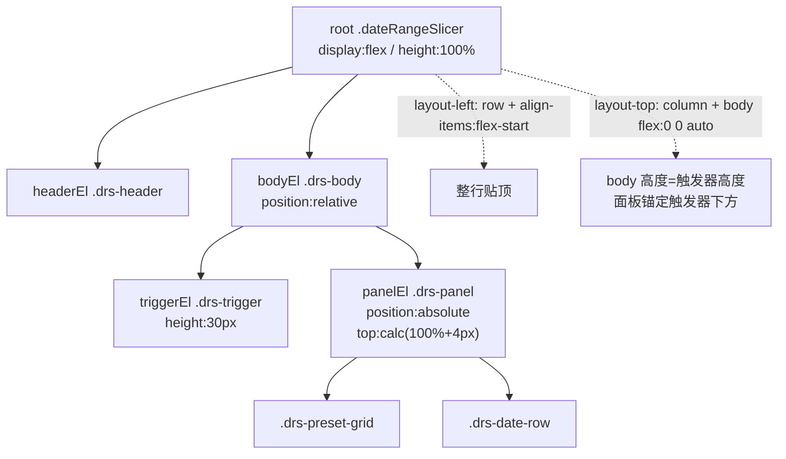

## 产品概述
优化 DateRangeSlicer（Power BI 自定义视觉）v2.4.3.0 的布局对齐：修复视觉对象被拉高后「标头 + 触发器」一行没有贴到视觉对象顶部的问题，并修复纵向布局下浮层面板定位基准错误导致的面板被裁切隐患。

## 核心需求
1. **内容顶部固定**：无论「标头位置=左侧」还是「标头位置=顶部」，标头与触发器组成的内容行都必须贴在视觉对象的顶部，不得因视觉对象被拉高而产生顶部空白。
2. **触发器贴顶优先**：触发器永远钉在顶部；下拉面板在触发器下方的剩余空间内展示，超出部分面板内部滚动（沿用 v2.4.3 的限高/翻转/极矮兜底逻辑，不改变）。
3. **面板锚定准确**：下拉面板必须始终出现在触发器正下方 4px 处，不得因容器尺寸变化而偏移到视觉对象之外被裁切。

## 边界与约束
- 仅调整布局样式，不改变筛选下发、预设联动、面板回收等既有业务逻辑。
- 两种标头布局（top / left）均需验证通过。
- 标头隐藏（`header.show=false`）时布局依然正确。


## 技术栈
沿用项目既有栈：Power BI 自定义视觉（pbiviz）+ TypeScript + LESS，单文件 `src/visual.ts` + `style/dateRangeSlicer.less`，构建命令 `npm run package`。

## 实现思路

### 根因：flex 主轴/交叉轴在两个布局下作用不同，`.drs-body` 的 `flex: 1 1 auto` 产生截然相反的后果

DOM 结构：
```
root(.dateRangeSlicer) → headerEl(.drs-header) + bodyEl(.drs-body)
bodyEl(.drs-body, position:relative) → triggerEl(.drs-trigger) + panelEl(.drs-panel, position:absolute)
```

面板定位依赖 `top: calc(100% + 4px)`，其中 `100%` 是 **`.drs-body` 的高度**。因此 body 的高度必须恰好等于触发器高度（30px），面板才会落在触发器正下方。

**问题 A（截图现象，标头位置=左侧）**
```
.drs-layout-left { flex-direction: row; align-items: center; }
```
- 主轴水平 → `.drs-body` 的 `flex:1 1 auto` 沿水平增长填充剩余宽度
- 交叉轴垂直 → `align-items: center` 把高度仅等于触发器高度（30px）的 body **垂直居中**
- 结果：整行上下各留空白，顶部出现大片空白（与截图一致）

**问题 B（隐藏 bug，标头位置=顶部）**
```
.drs-layout-top { flex-direction: column; align-items: stretch; }
```
- 主轴垂直 → `.drs-body` 的 `flex:1 1 auto` 沿**垂直**拉伸，body 高度 = 视觉剩余全部高度
- 面板 `top: calc(100% + 4px)` 的 `100%` 变成这个巨大的高度 → 面板被定位到视觉对象底部之外 → 被 iframe `overflow:hidden` **完全裁切、几乎不可见**
- 用户当前使用左侧布局故未暴露，但一切换标头位置就会遇到

### 修复方案（仅改 LESS，JS 逻辑零改动）

```less
/* 基础：把默认的垂直居中改为顶部对齐（两种布局的公共加固） */
.dateRangeSlicer { ... align-items: flex-start; ... }

/* 左侧布局：交叉轴（垂直）改为顶部对齐 */
.drs-layout-left { flex-direction: row; align-items: flex-start; justify-content: flex-start; gap: 6px; }

/* 顶部布局：禁止 body 沿垂直主轴被拉伸，使其高度 = 触发器高度，
   保证 .drs-panel 的 top: calc(100% + 4px) 精确等于「触发器底部 + 4px」 */
.drs-layout-top .drs-body { flex: 0 0 auto; }

/* 左侧布局下标头与触发器视觉对齐（两者均 30px 高） */
.drs-layout-left .drs-header { min-height: 30px; }
```

### 关键技术决策与权衡
1. **只改 CSS 不动 JS**：`positionPanel()` 的 `spaceBelow / spaceAbove` 基于 `getBoundingClientRect()` 实测，与 CSS 布局解耦。触发器贴顶后下方可用空间更大，限高、翻转、极矮兜底（`<100px` 退化为流内展开）逻辑继续生效且表现更好 —— 无需修改。
2. **保留 `.drs-panel` 的 `min-width:100% / max-width:420px / width:max-content`**（v2.4.2 右对齐触发器的修复成果），本次不触碰，避免回归。
3. **为什么 top 布局用 `flex: 0 0 auto` 而不是 `align-self: flex-start`**：后者只影响交叉轴（水平），无法阻止主轴（垂直）方向的拉伸；必须改 `flex-grow` 才能生效。
4. **为什么不用包裹层改 DOM**：新增一层容器可彻底解耦，但会改动构造函数与 `positionPanel()` 的定位基准，风险与改动量远大于一行 CSS。遵循最小改动原则。

### 性能与可靠性
- 纯 CSS 改动，无运行时计算开销，不影响 `update()` 频率。
- 不改变 `isPanelOpen` / `isDialogMode` 等状态机，不影响 v2.4.3 的 `window blur` 回收与白名单点击判定。
- 视觉对象尺寸变化时浏览器自动重排，无 JS 监听。

## 执行要点（防止回归）
- **必须同时验证两种布局**：top 布局此前完全不可用（面板被裁切），left 布局是截图问题，只验一种会漏。
- **必须验证标头隐藏场景**：`header.show=false` 时 `headerEl.style.display="none"`，left 布局下仅剩 body，`align-items:flex-start` 仍需保证触发器贴顶。
- **必须验证极矮兜底**：视觉高度不足 100px 时，`positionPanel()` 会加 `.drs-panel-inline` 让面板转为流内展开。此时 body 在 top 布局下为 `flex:0 0 auto`，面板 static 会自然撑高 body，依赖 root 的 `.drs-inline-mode { overflow-y:auto }` 滚动 —— 需确认未破坏。
- **面板右对齐不受影响**：`.drs-panel` 的 `right:0` 相对 body 定位；top 布局下 body 宽度仍为 100%（`align-items:stretch`），left 布局下 body 水平填充剩余宽度，两者均正确。

## 架构设计
本次为纯样式层调整，架构与数据流完全不变：



## 目录结构

```
visual/DateRangeSlicer/
├── style/
│   └── dateRangeSlicer.less   # [MODIFY] 布局对齐修复。① `.dateRangeSlicer` 基础 align-items 由 center 改为 flex-start（公共加固）；② `.drs-layout-left` align-items 由 center 改为 flex-start（修复截图问题：整行垂直居中导致顶部空白）；③ 新增 `.drs-layout-top .drs-body { flex: 0 0 auto; }`（修复隐藏 bug：body 沿垂直主轴被拉伸致面板定位基准错误、被 iframe 裁切）；④ 新增 `.drs-layout-left .drs-header { min-height: 30px; }`（标头与触发器等高对齐）。不改动 .drs-panel 的右对齐/限高/翻转/兜底样式。
├── src/
│   └── visual.ts              # [不改] positionPanel() 基于 getBoundingClientRect 实测，与 CSS 解耦；触发器贴顶后空间计算更优，无需调整
├── pbiviz.json                # [MODIFY] version 2.4.3.0 → 2.4.4.0，同步 description
├── CHANGELOG.md               # [MODIFY] 新增 2.4.4.0 条目，记录两个问题（左侧布局垂直居中、纵向布局面板被裁切）与修复方式
└── dist/
    └── DateRangeSlicer20260825004.2.4.4.0.pbiviz   # [NEW] 构建产物（GUID 不变，未改 capabilities.json，无需换 GUID）
```

## 关键代码结构
修复后的核心样式契约（body 高度必须等于触发器高度，这是面板定位正确的前提）：

```less
/* 不变量：.drs-body 的高度必须 = 触发器高度(30px)，
   否则 .drs-panel 的 top: calc(100% + 4px) 会定位错误 */
.drs-body {
    position: relative;
    flex: 1 1 auto;      /* left 布局：沿水平主轴填充剩余宽度 */
    display: flex;
    flex-direction: column;
}
.drs-layout-top .drs-body {
    flex: 0 0 auto;      /* top 布局：禁止沿垂直主轴拉伸 */
}
```


## Agent Extensions

### Skill
- **lsp-code-analysis**
  - 用途：在改动前对 `.drs-body` / `.drs-layout-top` / `.drs-layout-left` / `positionPanel` 做语义级引用与影响分析，确认除 `positionPanel()` 外没有其它 JS 逻辑依赖 `.drs-body` 的尺寸或布局，避免 CSS 改动引发隐性回归。
  - 预期结果：输出完整的引用点与调用链清单，确认本次修改的波及范围仅限样式层。

### SubAgent
- **code-explorer**
  - 用途：在 LESS 与 TS 中交叉检索所有与布局/尺寸/定位相关的规则与代码（如 `flex`、`height`、`getBoundingClientRect`、`inline-mode`），确认无遗漏的耦合点。
  - 预期结果：给出布局相关代码的完整清单，确保两种布局与三种面板模式（常规/翻转/极矮兜底）均被覆盖。
