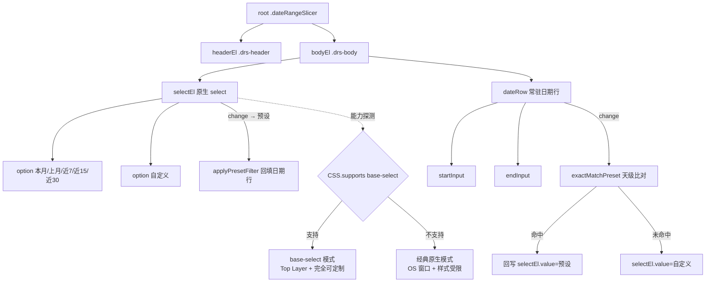

## 产品概述

产出一个基于浏览器原生 `<select>` 的日期区间切片器版本，用 OS/浏览器层渲染的下拉替代当前 v2.4.4.0 的自绘浮层面板，从根本上绕开 Power BI 自定义视觉 sandboxed iframe 对浮层的裁剪限制。

## 核心需求

1. **下拉改用原生 `<select>`**：预设项（本月/上月/近7天/近15天/近30天）作为 `<option>`，下拉弹出层由浏览器/OS 层渲染，可突破视觉对象 iframe 边界，不再被 `overflow:hidden` 裁切。
2. **保留既有的三者联动语义**（v2.4.2 建立，不得破坏）：预设即日期输入框的一组取值 —— 选预设自动回填两个日期输入框；手改日期若天级精确等于某预设则自动回到该预设态，否则为自定义态。
3. **验证可定制 select 能否补齐样式短板**：v2.3.3 当年放弃原生 select 的唯一理由是 `option:hover` 由系统渲染、CSS 不可控（只能整行变灰）。本版本尝试用 `appearance: base-select` + `::picker(select)` 实现暗色主题与「hover 只变字色」的可控样式；不支持时降级为经典原生 select。
4. **给出可实测的结论**：明确回答「原生 select 下拉是否真能突破 iframe」「可定制 select 在 PBI Desktop 的 Chromium 上是否可用」「样式能达到什么程度」三个问题。

## 边界与约束

- 原生 `<select>` 内部只能放 `<option>`，无法承载两个 `input[type=date]`。日期输入框放在 select 之外的视觉体内（常驻显示），这是本方案的架构取舍。
- 不改动筛选下发链路（`AdvancedFilter` + `applyJsonFilter`）、预设计算、持久化与切页恢复。
- 本版本为探索验证版，在独立分支上开发，`main` 保持 v2.4.4.0 稳定不动。


## 技术栈

沿用项目既有栈，不引入新依赖：Power BI 自定义视觉（pbiviz 5.x）+ TypeScript + LESS，单文件 `src/visual.ts` + `style/dateRangeSlicer.less`，构建命令 `npm run package`。

## 实现思路

### 原理：原生 select 的下拉为什么能突破 iframe

Chromium 官方设计文档《How Chromium Displays Web Pages》明确说明：

> The select boxes must be rendered using a native window so that they can appear above everything else.

即传统 `<select>` 的下拉弹出层**不是页面 DOM**，而是由浏览器进程用原生窗口绘制的控件，因此不受 iframe 的 `overflow:hidden` 与边界裁剪。

本项目在 v2.3.1.0 已实测验证过这一点（CHANGELOG 原文：「下拉面板由浏览器/操作系统绘制，可超出视觉 iframe 边界，彻底解决『下拉被视觉框截断』」）。后来 2.3.3.0 换回自绘 div **与裁剪无关**，纯粹是因为 `option:hover` 由 OS 渲染、CSS 无法控制。

也就是说：**裁剪问题当年已解决，样式可控性是唯一的遗留障碍。**

### 关键新情报：`appearance: base-select` 可定制 select

Chrome/Chromium 135+ 支持可定制 select：

```css
select, ::picker(select) { appearance: base-select; }
```

- 弹出层 `::picker(select)` 渲染在页面 **Top Layer**，不被父容器 `overflow` 裁剪，浏览器自动根据视口空间翻转定位
- 弹出层与 `option` **可用 CSS 完全自定义** —— 正好补上 v2.3.3 放弃 select 的唯一理由

**⚠️ 但这里有一个必须实测的关键分歧点**：传统 select 用原生窗口渲染（在 iframe 之外），而 `base-select` 的 `::picker(select)` 是 **Top Layer，属于 iframe 自身 document** —— 理论上**仍可能被 iframe 边界裁剪**。这两者是不同的渲染路径，不能想当然地认为 base-select 一定也能飞出 iframe。

因此本方案同时产出**两条路径**并在运行时按能力选择，由用户实测对比：

| 模式 | 触发条件 | 下拉渲染层 | 能否飞出 iframe | 样式可控度 |
|---|---|---|---|---|
| `base-select` | `CSS.supports('appearance: base-select')` 为真 | Top Layer（iframe 内） | **待测** | 完全可控 |
| 经典原生 | 不支持时降级 | OS 原生窗口 | 已实测可行 | 仅 option 背景/前景色 |

### 架构调整：日期输入框的处理

原生 select 无法承载子 DOM，因此把当前「触发器 + 浮层面板（预设网格 + 日期行）」拆成：

```
root → headerEl + bodyEl
bodyEl → selectEl(原生 select，承载 5 个预设 + 自定义项)
       → dateRow(startInput → endInput)   ← 常驻显示在视觉体内
```

自绘面板及其配套逻辑整体移除：`panelEl` / `presetGrid` / `presetEls` / `positionPanel()` / `openPanel()` / `closePanel()` / `togglePanel()` / `docClickHandler` / `blurHandler` / `keyHandler` / `.drs-panel*` 样式 / `drs-inline-mode`。

**这是净减数百行的简化** —— 原生 select 的开合、外部点击关闭、Esc、键盘导航全部由浏览器处理，v2.4.3 那套精心实现的回收机制在此方案下不再需要（与 v2.3.1.0 时的取舍一致）。

### 联动语义的迁移（保持 v2.4.2 不变）

```
select change
  ├─ 选中预设 → applyPresetFilter(preset) → 回填 dateRow（既有逻辑，零改动）
  └─ 选中"自定义" → 不动作，等待用户操作 dateRow

dateRow change (onCustomDateChange)
  ├─ exactMatchPreset 命中 → 回写 selectEl.value = 该预设（预设态）
  └─ 未命中 → selectEl.value = "__custom__"（自定义态）
```

`exactMatchPreset()` 的天级精确比对、`computePresetRange()`、`selectPreset()`、`applyCustomFilter()`、`ensureInputsFilled()`、`deriveTriggerLabel()` 全部保留复用。

## 实现要点（防止回归）

- **先做影响分析再删代码**：用 code-explorer / lsp-code-analysis 确认 `panelEl`、`presetEls`、`isPanelOpen` 的全部引用点，避免删漏导致悬空引用；`update()` 中的高亮调用需改为写 `selectEl.value`。
- **`updatePresetHighlight()` 语义变更**：原逻辑遍历 `presetEls` 加 `.active` class，改为设置 `selectEl.value`。需同步处理 `currentPreset=""`（自定义态）时选中 `__custom__` 项。
- **`deriveTriggerLabel()` 的去留**：触发器被 select 取代后，触发器文本由 select 自身显示选中项，该方法若仍被 `update()` 调用需评估；自定义态下 select 显示「自定义」文字即等价。
- **能力探测必须显式暴露**（吸取 v2.5.0.0 静默回退的教训）：把 `CSS.supports('appearance: base-select')` 结果、UA 中的 Chromium 版本、当前生效模式写入 `labelEl.title`，一眼可辨，不要静默降级。
- **换 GUID**：本版本要改 `capabilities.json`（新增 select 模式相关配置），按项目经验不换 GUID 时 PBI Desktop 会沿用内存旧实例，探索期极易误判「改了没生效」。
- **构建用相对路径**：`cd visual\DateRangeSlicer; npm run package`（PowerShell 遇中文路径会按 GBK 解析报路径不存在）。
- **产物校验格式**：CSS 与 JS 内嵌在 `resources/<guid>.pbiviz.json`，且 CSS **未压缩**（保留换行与注释），正则须用 `(?s)\.class \{.*?\}` 而非紧凑形式，否则全部误报 MISS。

## 架构设计



## 目录结构

```
visual/DateRangeSlicer/
├── src/
│   └── visual.ts                    # [MODIFY] 主要改动文件
│                                    #   ① 新增 selectEl（原生 select，options = 5 预设 + 自定义）
│                                    #   ② 移除自绘面板：panelEl / presetGrid / presetEls / positionPanel /
│                                    #      openPanel / closePanel / togglePanel / docClickHandler /
│                                    #      blurHandler / keyHandler / isInteractiveTarget / evaluateBlurClose
│                                    #   ③ 保留并复用：computePresetRange / selectPreset / applyPresetFilter /
│                                    #      exactMatchPreset / onCustomDateChange / applyCustomFilter /
│                                    #      syncDateInputs / ensureInputsFilled / resolveRange / persistProperties
│                                    #   ④ updatePresetHighlight 改为写 selectEl.value
│                                    #   ⑤ 新增 detectSelectCapability() 能力探测，结论写入 labelEl.title
├── style/
│   └── dateRangeSlicer.less         # [MODIFY] ① 新增 .drs-native-select 基础样式（复用 --drs-* 变量）
│                                    #   ② 新增 @supports (appearance: base-select) 分支：
│                                    #      select + ::picker(select) + option 的暗色定制与 hover 只变字色
│                                    #   ③ 移除 .drs-panel / .drs-panel-open / .drs-panel-up /
│                                    #      .drs-panel-inline / .drs-inline-mode / .drs-preset-grid /
│                                    #      .drs-preset / @keyframes drs-pop-* 等自绘面板样式
│                                    #   ④ 保留 .drs-date-row / .drs-date-input / 贴顶修复规则
├── capabilities.json                # [MODIFY] 新增 select 模式相关配置项（故需换 GUID）
├── pbiviz.json                      # [MODIFY] version 2.4.4.0 → 2.5.0.0，GUID → DateRangeSlicer20260825008，
│                                    #          displayName 改为「日期区间切片器 v2.5-原生下拉」便于辨识
├── CHANGELOG.md                     # [MODIFY] 新增 2.5.0.0 条目，记录原理、两条渲染路径与待测项
└── dist/
    └── DateRangeSlicer20260825008.2.5.0.0.pbiviz   # [NEW] 构建产物
```

## 关键代码结构

原生 select 与联动的核心契约（接口级定义）：

```typescript
/** 原生 select 的选项值：5 个预设 key + 自定义态哨兵值 */
const CUSTOM_VALUE = "__custom__";

/** 能力探测结果（显式暴露，不做静默降级） */
interface SelectCapability {
    baseSelect: boolean;   // CSS.supports('appearance: base-select')
    chromium: string;      // UA 中的 Chromium 主版本号，用于判断 >=135
    mode: "base-select" | "classic-native";
}
```

```typescript
/** select 变更 → 分流到预设或自定义（复用既有筛选逻辑，不重写） */
private onSelectChange(): void;

/** 日期行变更 → 天级精确比对后回写 select 选中态（保持 v2.4.2 语义） */
private syncSelectFromDates(start: Date, end: Date): void;

/** 探测可定制 select 支持度，结论写入 labelEl.title 供实测读取 */
private detectSelectCapability(): SelectCapability;
```


## 设计风格

沿用项目既有的深蓝暗色主题（与「营收分析-顶部导航版.html」顶栏对齐），保持视觉一致性：

- **原生 select 触发器**：外观尽量贴近当前 `.drs-trigger` 胶囊 —— 暗色底 `#142436`、边框 `#2C4A6B`、圆角 3px、高 30px、字号 12px、右侧下拉箭头。用 `appearance: none` 清除系统默认外观后自绘箭头。
- **下拉弹出层**：暗色面板底 `#0A1428`、文字 `#FFFFFF`；选中项用强调蓝 `#378ADD` 描边 + 半透明蓝底，`hover` **只变字色**为 `#B4B2A9`（这是 v2.3.3 当年放弃原生 select 的核心诉求，`base-select` 模式下可实现；经典模式下受 OS 限制只能整行变灰，属已知降级）。
- **日期行**：保持现有 `.drs-date-row` 样式不变（两个暗色输入框 + 中间「→」分隔箭头），常驻显示在 select 下方。

## 布局

采用纵向堆叠：标头 → 原生 select → 日期行。继承 v2.4.4 的贴顶规则（`.drs-layout-top .drs-body { flex: 0 0 auto }`、`.drs-layout-left { align-items: flex-start }`），确保视觉对象拉高时内容仍贴顶。

## 状态表达

- **预设态**：select 显示预设名（如「本月」），日期行回填该预设的起止日期。
- **自定义态**：select 显示「自定义」项，日期行显示用户手选区间。

## 交互

下拉开合、外部点击关闭、Esc、键盘上下键选择全部交由浏览器原生处理，不再自绘浮层与回收监听 —— 交互手感与原生切片器完全一致，这是本方案相较自绘浮层的核心体验优势。

## Agent Extensions

### SubAgent
- **code-explorer**
  - 用途：在动手删除自绘面板代码前，全量检索 `panelEl`、`presetEls`、`isPanelOpen`、`positionPanel`、`togglePanel`、`docClickHandler`、`blurHandler` 的所有引用点，输出精确行号清单，确保删除时无遗漏、无悬空引用。
  - 预期结果：给出待删除代码的完整引用清单与 `update()` / `applyStyles()` 中需同步调整的位置。

### Skill
- **lsp-code-analysis**
  - 用途：对 `updatePresetHighlight()`、`deriveTriggerLabel()`、`selectPreset()` 做调用层级分析，确认改为写 `selectEl.value` 后不会产生重复调用或状态不一致；并核对 `exactMatchPreset` 与 `onCustomDateChange` 的联动链在 select 方案下仍然完整。
  - 预期结果：确认联动链完整、无断裂，并指出需要同步修改的具体行。
