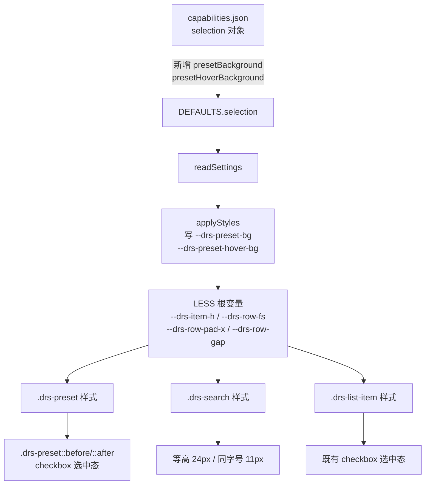

## 用户需求

用户经历了 v2.8.0.0~2.8.0.4 多个零散 patch（列表布局、checkbox、对齐、字号、滚动条箭头等），明确批评"开发一个版本不断有缺陷，要有全局长远方案、查缺补漏"。贴图对比预设模式（左）与列表模式（右）的 UI 缺陷后，要求一次性全局统一两种模式的视觉与交互语言。

经澄清确认两项关键诉求：
1. **预设项默认淡白底 `rgba(255,255,255,0.03)` 硬编码不可配** → 需暴露为格式面板配置项（默认背景、悬浮背景）。
2. **预设模式选中态统一成 checkbox 风格** → 预设项也加左侧勾选框，选中态改为"勾选框 + 文字高亮"，与列表模式完全一致（不再用整行蓝框 + 半透明蓝底）。

## 核心功能

1. **设计 token 化**：引入统一行高、行字号、水平内边距、行间距变量，消除散落字面量。
2. **预设项样式对齐列表项**：行高 30→24px、字号 12→11px、水平 padding 10→8px、左 padding 28px 给 checkbox；预设项背景/悬浮背景由硬编码改为 CSS 变量驱动。
3. **预设选中态 checkbox 化**：预设项加 `::before` 勾选框、`active` 时填强调色 + `::after` 白色对勾；`.active` 去整行蓝边框与 `font-weight:600`，改为仅文字高亮（与列表项一致）。
4. **预设项背景可配**：capabilities 新增 `presetBackground` / `presetHoverBackground`，链路贯通 DEFAULTS / readSettings / applyStyles / 格式面板。
5. **搜索框统一**：高度 28→24px、字号 12→11px，与列表项等高同字号。
6. **GUID 变更**：因 capabilities 新增属性，换 GUID 010→011、版本 2.8.0.4→2.9.0.0，强制 PBI 丢弃内存旧实例。


## 技术栈

- Power BI Custom Visuals API 5.4.0
- TypeScript + LESS + Webpack
- 无前端框架依赖
- 构建：`cmd /d /c "chcp 65001 >nul & cd /d c:\Users\hdc\Desktop\营收概况\visual\DateRangeSlicer && npm run package"`（PowerShell 中文路径需用 cmd + chcp 65001 绕过）

## 实现方案

### 总体策略

沿用项目既有的「配置项 → CSS 变量 → LESS 引用」链路（v2.7 建立）。本次为一次**全局视觉统一大改**：把预设模式与列表模式统一成同一套"可选择行"视觉语言（24px 行高、11px 字号、8px 水平内边距、左侧 checkbox、文字高亮选中态），并将预设项背景从硬编码改为可配。capabilities 新增 2 个属性触发换 GUID。

### 关键修改点

**1. 设计 token 化（LESS 顶部 `.dateRangeSlicer` 变量区）**

在 `.dateRangeSlicer` 基础规则内新增：
```
--drs-item-h: 24px;          /* 统一行高 */
--drs-row-fs: 11px;          /* 统一行字号 */
--drs-row-pad-x: 8px;        /* 统一水平内边距 */
--drs-preset-bg: rgba(255,255,255,0.03);
--drs-preset-hover-bg: rgba(255,255,255,0.05);
```
`.drs-list` 已有 `--drs-item-h: 24px`，统一到根变量避免重复。

**2. 预设项样式对齐列表项（LESS `.drs-preset` / `.drs-preset-grid`）**

- `.drs-preset-grid`：`gap: 6px` → `gap: var(--drs-row-gap, var(--drs-list-gap, 2px))`（与列表行间距一致；在根变量区加 `--drs-row-gap: var(--drs-list-gap, 2px)`）
- `.drs-preset`：`height: 30px` → `height: var(--drs-item-h)`；`padding: 0 10px` → `padding: 0 var(--drs-row-pad-x) 0 28px`；`font-size: 12px` → `font-size: var(--drs-row-fs)`；`background: rgba(255,255,255,0.03)` → `background: var(--drs-preset-bg)`；`border: 1px solid transparent` 保留（checkbox 留位用）
- `.drs-preset:hover`：`background: rgba(255,255,255,0.05)` → `background: var(--drs-preset-hover-bg)`
- `.drs-preset.active`：移除 `border: 1px solid var(--drs-accent)`、`font-weight: 600`、`background: rgba(55,138,221,0.18)`，改为仅 `color: var(--drs-list-active-fg, #378ADD)`（与列表项 `.active` 一致）
- 新增 `.drs-preset::before`：复用列表项 checkbox 方框样式（`position:absolute; left:8px; top:50%; transform:translateY(-50%); width:14px; height:14px; border:1px solid var(--drs-border); border-radius:2px; background: var(--drs-bg)`）
- 新增 `.drs-preset.active::before`：填 `var(--drs-accent)` + 边框 accent
- 新增 `.drs-preset.active::after`：白色对勾（4×8 旋转 45°，left:13px）
- `.drs-preset` 需加 `position: relative`（与列表项一致）

**3. 搜索框统一（LESS `.drs-search`）**

- `height: 28px` → `height: var(--drs-item-h)`
- `font-size: 12px` → `font-size: var(--drs-row-fs)`
- `padding: 0 8px` 保持不变（已是 8px 与 token 一致）

**4. capabilities 新增 2 属性（selection 对象）**

```json
"presetBackground": { "displayName": "预设项默认背景色", "type": { "fill": { "solid": { "color": true } } } },
"presetHoverBackground": { "displayName": "预设项悬浮背景色", "type": { "fill": { "solid": { "color": true } } } }
```

**5. DEFAULTS / readSettings / applyStyles 同步**

- `DEFAULTS.selection` 加 `presetBackground: "rgba(255,255,255,0.03)"`、`presetHoverBackground: "rgba(255,255,255,0.05)"`
- `readSettings` 加：
  ```
  this.settings.selection.presetBackground = color(s.presetBackground, DEFAULTS.selection.presetBackground);
  this.settings.selection.presetHoverBackground = color(s.presetHoverBackground, DEFAULTS.selection.presetHoverBackground);
  ```
- `applyStyles` 加：
  ```
  this.root.style.setProperty("--drs-preset-bg", s.presetBackground);
  this.root.style.setProperty("--drs-preset-hover-bg", s.presetHoverBackground);
  ```

**6. 格式面板新增配置项（getFormattingModel「列表项」组末尾）**

在「列表项」组 slices 末尾追加两项（与 `listHoverBackground` 并列，命名清晰对应预设模式）：
- 「预设项默认背景色」`colorPicker("selection", "presetBackground", selection.presetBackground)`
- 「预设项悬浮背景色」`colorPicker("selection", "presetHoverBackground", selection.presetHoverBackground)`

**7. 换 GUID + 版本（pbiviz.json）**

- `guid`: `DateRangeSlicer20260825010` → `DateRangeSlicer20260825011`
- `version`: `2.8.0.4` → `2.9.0.0`
- `displayName`: 「日期区间切片器 v2.9-双模式视觉统一」
- `description`: 概述本次统一（行高/字号/左对齐/checkbox 选中态/预设背景可配）

**8. 不改项**

- 触发器样式、面板背景 `listBackground`、选中文字/背景变量、滚动条（8px 暗色）、列表行间距配置、深蓝暗色主题全部保留
- 预设/列表的 JS 逻辑（`selectPreset` / `toggleListItem` / 白名单 / 筛选下发）**完全不动**，仅 DOM 视觉类名复用同一套 checkbox 伪元素约定

### 性能与兼容性

- CSS 变量与 `calc()` 零运行时开销，`applyStyles()` 仅 update 时调用一次
- 新增属性有 DEFAULTS 回落，旧报表兼容（缺失时回落硬编码默认值）
- GUID 变更后旧视觉实例需删除画布旧视觉、重新导入（capabilities 变更硬性要求）
- 搜索框 `box-sizing: border-box` 保证 height 改变不影响宽度布局

### 产物校验

解包 `dist/DateRangeSlicer20260825011.2.9.0.0.pbiviz`，对 `resources/DateRangeSlicer20260825011.pbiviz.json` 做关键词匹配：
- `.drs-preset` 的 `height:var(--drs-item-h)`、`padding:0 8px 0 28px`、`font-size:var(--drs-row-fs)`、`background:var(--drs-preset-bg)`
- `.drs-preset::before` / `.drs-preset.active::after` checkbox 伪元素存在
- `.drs-preset.active` 无 `border: 1px solid` 整行边框、无 `font-weight: 600`、无 `rgba(55,138,221,0.18)` 整行蓝底
- `--drs-preset-bg` / `--drs-preset-hover-bg` 变量写入 JS
- `presetBackground` / `presetHoverBackground` 属性存在
- `.drs-search` 的 `height:var(--drs-item-h)`、`font-size:var(--drs-row-fs)`
- 版本 `2.9.0.0` / GUID `DateRangeSlicer20260825011`

## 架构设计

### 系统架构图



### 模块划分

- **样式模块（style/dateRangeSlicer.less）**：根变量区新增 token；重写 `.drs-preset` 系列与 `.drs-search` 高度/字号；预设项 checkbox 伪元素
- **配置链路（src/visual.ts）**：capabilities 声明 → DEFAULTS → readSettings → applyStyles → 格式面板
- **产物（dist）**：构建生成 pbiviz，GUID 011 / 2.9.0.0

## 目录结构

```
visual/DateRangeSlicer/
├── capabilities.json              # [MODIFY] selection 对象新增 presetBackground / presetHoverBackground
├── pbiviz.json                    # [MODIFY] guid 010→011、version 2.8.0.4→2.9.0.0、displayName/description 更新
├── src/visual.ts                  # [MODIFY] DEFAULTS 加 2 属性；readSettings 加 2 行；applyStyles 写 2 个 CSS 变量；getFormattingModel「列表项」组加 2 个 colorPicker
├── style/dateRangeSlicer.less     # [MODIFY] 根变量区加 token；重写 .drs-preset 系列（行高/字号/padding/背景/checkbox 伪元素）；.drs-search 高度字号统一
├── CHANGELOG.md                   # [MODIFY] 顶部插入 2.9.0.0 条目
└── dist/                          # [MODIFY] 新增 DateRangeSlicer20260825011.2.9.0.0.pbiviz，删除被取代的 2.8.0.4 产物
```

