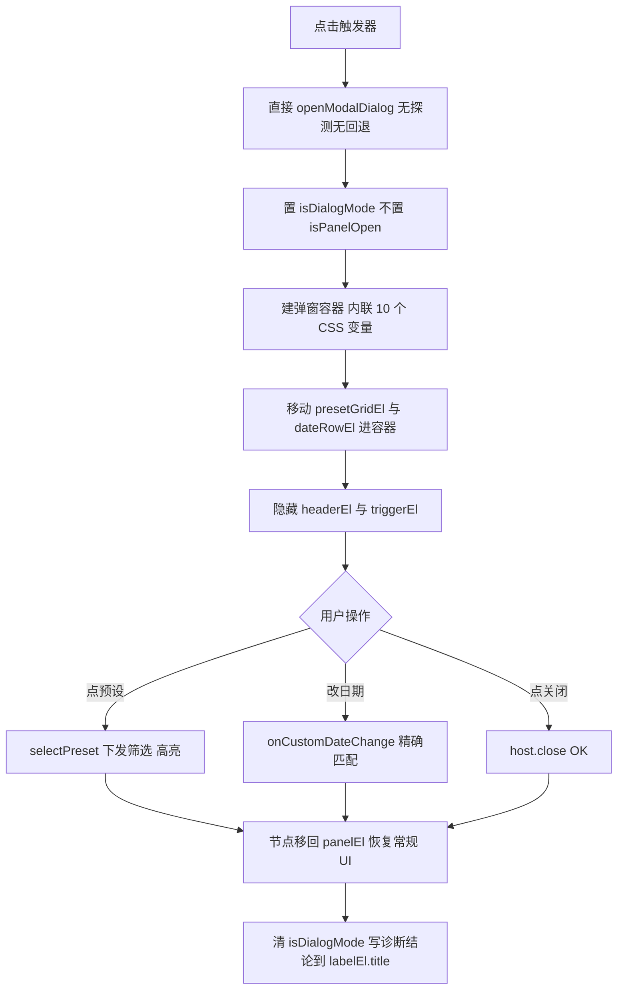

## 用户需求

对 Power BI 自定义视觉「日期区间切片器」的下拉面板做**承载方式改造**：放弃 v2.4.x 的「视觉内浮层」方案，改为**直接使用宿主模态框 `openModalDialog`**，点击触发器无条件弹出，不做能力探测、不做回退。

用户原话：「不用判断是否走 openModalDialog，直接只使用它，不要兜底，只是样式要用参考之前的」

### 核心功能

1. **移除分流与兜底**：删除 `explore.useModalDialog` 开关、`detectDialogSupport()` 的流程分支作用、以及失败时回退到浮层的逻辑。点击触发器即调用 `openModalDialog`，无第二路径。
2. **弹窗承载完整面板**：内容包含 5 个预设按钮（本月/上月/近7天/近15天/近30天，2 列网格）+ 开始/结束两个原生日期输入框 + 「→」分隔符 —— 即当前 v2.4.x 浮层面板的完整内容，不是验证用的极简版本。
3. **样式完全沿用现有暗色配色**：预设卡片半透明白底、hover 只变字色不改背景、选中态强调蓝底+边框+发光；日期输入框暗色底+边框+圆角、原生日历图标 `invert(1)` 反色。
4. **交互逻辑原样复用**：选预设立即下发筛选，手改日期命中预设则回预设态（`exactMatchPreset` 精确匹配），其余为自定义态。
5. **保留诊断行**：观测弹窗落点、尺寸、`rightAligned`、父容器，用于判断官方硬限制的实际表现。

### 边界

- 不做能力探测分流（用户明确要求）
- 不重建面板 DOM，采用节点移动方案以保留已绑定的事件监听与选中态
- 不动 v2.4.3.0 的筛选下发链路（`applyPresetFilter` / `applyCustomFilter` / `AdvancedFilter`）


## 技术栈

沿用项目既有技术栈，不引入任何新依赖：

- TypeScript（ES6 target）、Power BI Custom Visual API 5.4.0、`powerbi-visuals-tools ^5.1.1` + webpack 5、LESS
- 运行环境：Power BI sandboxed iframe；弹窗模式下 DOM 由宿主搬迁至页面顶层
- 构建命令（必须相对路径）：`cd visual\DateRangeSlicer; npm run package`

## 实现思路

**核心策略：移动 DOM 节点，而非重建面板。**

现有 `.drs-preset-grid`（5 个按钮）与 `.drs-date-row`（两个输入框）上已绑定 click/change 监听，选中态通过 `this.presetEls` 维护。直接把这两个节点 `appendChild` 到弹窗容器 —— DOM 移动会自动保留节点上的事件监听与引用，因此 `selectPreset()` / `onCustomDateChange()` / `updatePresetHighlight()` / `syncDateInputs()` 全部零改动复用，不需要重写任何交互逻辑。关闭弹窗时再移回 `panelEl`。

**关键技术决策：**

- **为何移动而非重建**：重建会丢失按钮的 click 监听与 `this.presetEls` 引用，导致 `updatePresetHighlight()` 找不到节点、选中态失效。移动是零风险方案。
- **移动方案天然解决 CSS 变量继承**：弹窗容器被宿主搬到页面顶层后，拿不到 `.dateRangeSlicer` 上的 `--drs-*`。但只要把变量以内联 style 设在弹窗容器上，移入其中的预设/日期节点就会**从父级继承**这些变量，样式自动生效，无需为弹窗单独写一套 LESS。需内联 10 个变量：`--drs-bg`/`--drs-fg`/`--drs-border`/`--drs-accent`/`--drs-radius`/`--drs-border-width`/`--drs-list-bg`/`--drs-list-fg`/`--drs-list-hover-fg`/`--drs-list-hover-bg`。
- **弹窗态不得置 `isPanelOpen = true`**：否则 v2.4.3.0 的 `window blur` 回收监听会在宿主抢走焦点时误触发 `closePanel()`，与弹窗逻辑打架。二者互斥。
- **必须修复守卫顺序 bug（本轮发现）**：当前 `update()` 中 `applyStyles()`（第 331 行）执行在 `isDialogMode` 守卫（第 343 行）**之前**。弹窗打开期间一旦触发 update，`applyStyles()` 会把已隐藏的标头/触发器重新显示，与弹窗打架。守卫必须上移到 `applyStyles()` 之前。
- **必须换 GUID**：本轮删除 `capabilities.json` 的 `explore` 对象属 capabilities 变更。不换 GUID 时 PBI Desktop 沿用内存中的旧实例，用户会看到「改了没生效」——这正是上一轮困惑的根源。
- **`displayName` 必须加版本后缀**：新旧视觉对象同名（都叫「日期区间切片器」），PBI 视觉对象面板中并存时极易选错。改为「日期区间切片器 v2.6-弹窗」。

**性能与可靠性**：节点移动为一次性操作，无热路径开销；`host.close` 与 `openModalDialog` 调用包 try-catch，即使 API 不可用也不会抛错卡死（但**不回退**到浮层 —— 按用户要求保持单一路径，仅把错误写入诊断行与 `labelEl.title` 供排查）。

## 执行要点

- `presetGrid` 与 `dateRow` 当前是构造函数局部变量（分别在第 185 行、第 205 行附近），需先提升为私有成员字段 `this.presetGridEl` / `this.dateRowEl` 才能移动。
- 弹窗内容组装顺序：诊断行 → 预设网格 → 日期行 → 关闭按钮。
- 关闭时（按钮点击、`host.close` 回调）必须把 `presetGridEl` 与 `dateRowEl` **移回 `panelEl`**，否则下次打开浮层时面板为空。
- 弹窗打开时隐藏 `headerEl` 与 `triggerEl`，关闭后按 `settings.header.show` 恢复。
- 保留 `measureDialog()`，并保留「重新测量」按钮观察宿主是否异步搬迁 DOM。
- 保留顶部 `declare module` 补全的 `openModalDialog` / `host.close` / `hostCapabilities` 类型声明与 `DIALOG_ACTION` / `DIALOG_POSITION` 常量（5.4.0 类型定义不含这些，不补全无法通过 tsc）。
- 产物校验：解包后对 `resources/*.pbiviz.json` 做关键词 `Contains` 匹配；区分大小写检查用 `-cmatch`。

## 架构设计



## 目录结构

```
c:\Users\hdc\Desktop\营收概况\visual\DateRangeSlicer\
├── src\
│   └── visual.ts            # [MODIFY] ① presetGrid/dateRow 提升为成员字段 presetGridEl/dateRowEl；
│                            #   ② 删除 explore 开关与 detectDialogSupport 分流，触发器点击直接
│                            #   openModalDialog；③ openDialogPanel() 建容器并内联 10 个 CSS 变量，
│                            #   移动两个节点进容器；④ closeDialogPanel() 移回节点、恢复常规 UI；
│                            #   ⑤ 修复 isDialogMode 守卫位置（上移到 applyStyles 之前）；
│                            #   ⑥ 保留诊断行、measureDialog、labelEl.title 结论输出。
│                            #   约束：弹窗态不得置 isPanelOpen=true。
├── capabilities.json        # [MODIFY] 删除 explore 对象（含 useModalDialog 属性）。
├── pbiviz.json              # [MODIFY] GUID 改 DateRangeSlicer20260825006（capabilities 变更必须换，
│                            #   否则沿用旧实例）；version 升 2.6.0.0；displayName 改为
│                            #   「日期区间切片器 v2.6-弹窗」以便与旧实例区分。
├── style\
│   └── dateRangeSlicer.less # [MODIFY] 新增 .drs-dialog 布局样式（诊断行、关闭按钮、flex 排列）；
│                            #   颜色仍由内联 CSS 变量提供，LESS 仅管布局排版。
└── CHANGELOG.md             # [MODIFY] 新增 2.6.0.0 条目：单路径改造、节点移动方案、内联变量、
                             #   守卫顺序 bug 修复、GUID 与 displayName 变更说明。
```

## 关键代码结构

弹窗容器需内联全部 10 个 CSS 变量，移入其中的预设/日期节点才能继承样式：

```typescript
/** 弹窗容器内联 CSS 变量：弹窗 DOM 在宿主顶层，拿不到 .dateRangeSlicer 上的 --drs-*。
 *  变量设在容器上后，移入的 presetGridEl / dateRowEl 会自动继承，无需另写一套样式。 */
private applyDialogVariables(el: HTMLElement): void {
    const s = this.settings.selection;
    el.style.setProperty("--drs-bg", s.backgroundColor);
    el.style.setProperty("--drs-fg", s.accentColor);
    el.style.setProperty("--drs-border", s.borderColor);
    el.style.setProperty("--drs-accent", s.accentColor);
    el.style.setProperty("--drs-radius", `${s.borderRadius}px`);
    el.style.setProperty("--drs-border-width", `${s.borderWidth}px`);
    el.style.setProperty("--drs-list-bg", s.listBackground);
    el.style.setProperty("--drs-list-fg", s.listText);
    el.style.setProperty("--drs-list-hover-fg", s.listHoverText);
    el.style.setProperty("--drs-list-hover-bg", s.listHoverBackground);
}
```

> 注：`openModalDialog` 的 `VisualDialogOptions` 字段形态（尤其 `initialState` / `onClose`）为最小草案，需在 PBI Desktop 实测确认，诊断行即为校验手段。


## Agent Extensions

### Skill
- **lsp-code-analysis**
  - Purpose：改造 `update()` 流程前，用 LSP 的 outline / references 列举 `DateRangeSlicer` 类中所有会改动 UI 状态的方法与调用点（`applyStyles` / `positionPanel` / `ensureInputsFilled` / `deriveTriggerLabel` / `updatePresetHighlight` / `syncDateInputs`），确保 `isDialogMode` 守卫完整覆盖，不遗漏弹窗期间会篡改常规 UI 的分支。
  - Expected outcome：得到完整的「弹窗期间需屏蔽的方法清单」，据此确定守卫应放置的确切位置。
