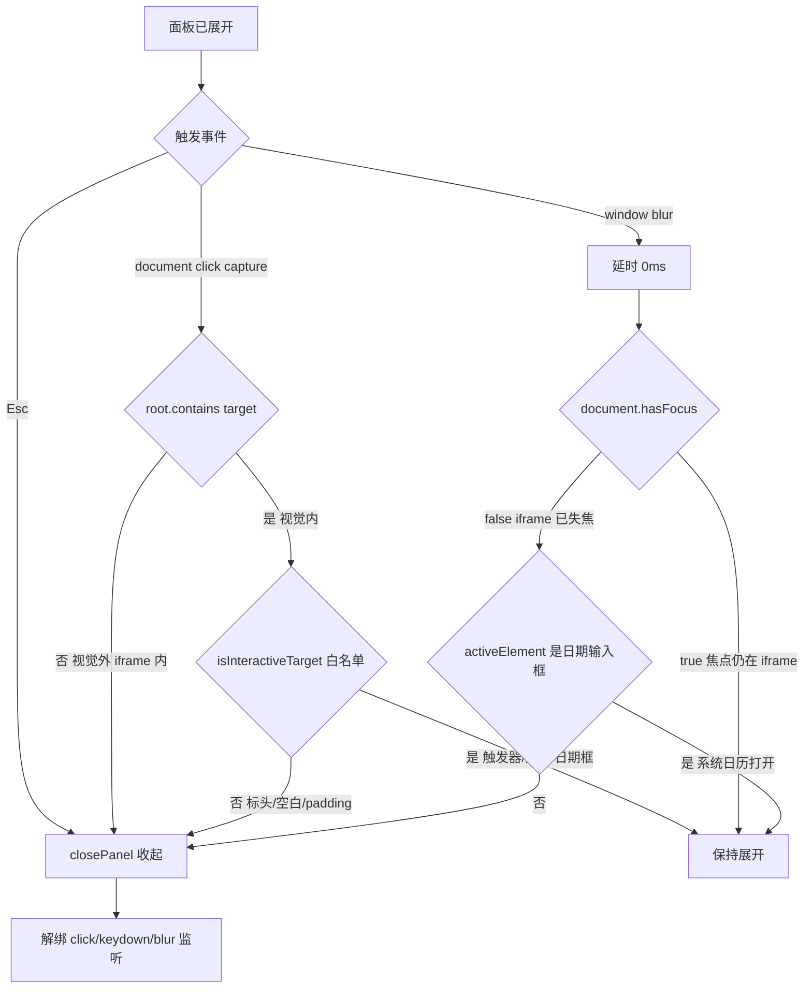

## User Requirements

为 Power BI 自定义视觉「日期区间切片器」的浮层下拉面板补充完整的收起（回收）机制。当前只有点击预设选项才会收起，其余情况面板会一直停留在展开状态。

需要补齐三类收起触发：
1. 点击视觉对象**外部**（PBI 画布空白处、其他视觉对象、功能区/格式面板）
2. 点击视觉对象**内部的非交互区域**（标头文字、面板内边距空白、分隔箭头、视觉容器边缘空白）
3. 沿用原有的 Esc 键收起

用户已明确两项边界：
- **判定最严格**：除触发器、预设按钮、两个日期输入框外的一切区域，点击均收起
- **日历逻辑不改**：点日期输入框弹出系统日历选日期的行为必须完全保持现状，新增监听不得打断该过程

## Product Overview

下拉面板展开后，任何「用户意图离开」的操作都能可靠地让面板收起，同时不影响正常的日期选择交互。面板外观、定位、右对齐、翻转与限高滚动等视觉表现均不变，仅补充交互回收逻辑。

## Core Features

- **内部空白收起**：点击视觉内非白名单元素立即收起
- **失焦回收**：视觉对象（iframe）失去焦点时自动收起，涵盖点到 PBI 画布任意其他位置
- **交互白名单**：触发器、5 个预设按钮、开始/结束日期输入框及其内部节点保持展开
- **日历豁免**：焦点位于日期输入框或 iframe 仍持有焦点时，忽略失焦，保证系统日历选日期不受干扰
- **原有行为保持**：Esc 收起、点预设收起、点触发器开关收起均不变，且不得出现「点触发器关不掉」的开关死循环


## Tech Stack Selection

沿用项目既有技术栈，不引入任何新依赖：

- 语言：TypeScript（ES6 target，`tsconfig.json` 未开 `noUnusedLocals`）
- 宿主 API：Power BI Custom Visual API 5.4.0（`powerbi-visuals-api ~5.4.0`）
- 构建：`powerbi-visuals-tools ^5.1.1` + webpack 5，命令 `cd visual\DateRangeSlicer; npm run package`
- 样式：LESS（本次不涉及改动）
- 运行环境：Power BI 的 **sandboxed iframe**

## Implementation Approach

**核心策略**：当前「点击外部无法收起」的根因是 **iframe 隔离**——点击 PBI 画布其他位置时，事件发生在 iframe 之外，iframe 内的 `document` 完全收不到 click 事件（项目技能文档 v1.1–v1.4 自绘弹层时期已验证）。因此单靠 `document` 监听无解，必须补 **iframe 级别的 `window blur`**。

**整体方案**：三条独立关闭通道 + 一个统一白名单判定。

1. **内部/iframe 内外部点击** → 改造现有 `docClickHandler`（document capture 阶段）。原判定 `!root.contains(target)` 仅处理视觉外，新增「视觉内但非白名单元素」分支。
2. **iframe 外点击** → 新增 `window blur` 监听，这是覆盖 PBI 画布其他区域的唯一可行通道。
3. **Esc** → 保留现有 `keyHandler`。

**关键技术决策与权衡**：

- **为何用白名单而非黑名单**：用户要求「最严格」判定，除 4 类交互元素外一律收起。白名单（显式列举 trigger / presetEls / startInput / endInput）比黑名单（判断是否在 panel 内）更贴合语义，也不会因未来往面板里加装饰元素而意外豁免。代价是新增元素时需手动登记，但面板结构稳定，可接受。
- **为何 trigger 必须在白名单**：`docClickHandler` 注册在 **capture** 阶段，早于 trigger 自身 **bubble** 阶段的 handler 执行。若 trigger 不在白名单，点击已展开的触发器会先被判定为「空白」而 `closePanel()`，随后 trigger 的 handler 再 `togglePanel()` 把它打开，形成**关不掉的开关死循环**。这是本次最关键的回归风险点。
- **为何 blur 后延时 0ms 再判定**：`blur` 事件触发瞬间 `document.activeElement` 尚未稳定。延后一个宏任务让浏览器完成焦点转移，判定才准确。
- **为何用 `document.hasFocus()` 二次确认**：区分「整个 iframe 失焦（用户点到了 PBI 画布别处）」与「iframe 内焦点移动或原生 picker 打开」。iframe 仍持有焦点说明用户还在本视觉内操作，不应收起。
- **为何豁免 `activeElement` 为日期输入框**：直接对应用户「日历逻辑不用改」的要求。弹出系统日历时若立即收起会打断选日期，属于必须避免的回归。
- **YAGNI：暂不引入 `focusout`**：本视觉独占一个 iframe 且 root 基本占满，`window blur` + `document click` 已覆盖全部场景。`focusout` 还需处理元素可聚焦性判定，复杂度无收益。若实测 PBI 某容器不触发 iframe blur，再行补充。

**性能与可靠性**：所有监听均在 `openPanel()` 注册、`closePanel()` 解绑，面板关闭时零常驻开销；`destroy()` 兜底解绑并清理延时器，避免视觉销毁后回调仍执行。判定逻辑为 O(1)（trigger/input 的 `contains`）加 O(n)（n=5 预设按钮），可忽略。

## Implementation Notes

- **注册/解绑对称性**：`openPanel()` 中 `window.addEventListener("blur", this.blurHandler)`，`closePanel()` 中对应 `removeEventListener`，`destroy()` 中再兜底一次（防御面板处于展开态时视觉被销毁）。
- **延时器管理**：`blurHandler` 用 `window.setTimeout(..., 0)`，需把返回的 timer id 存为成员字段，在 `closePanel()` 与 `destroy()` 中 `clearTimeout` 并置 null，防止内存泄漏与销毁后误触发。
- **`evaluateBlurClose()` 内的守卫顺序**：先 `isPanelOpen` → 再 `document.hasFocus()` → 再 `activeElement` 判定 → 最后 `closePanel()`，任一条件不满足即返回，保持展开。
- **不要动日期输入框的 `change` 事件与 `onCustomDateChange()` 链路**，v2.4.2 的「手改日期命中预设即回预设态」逻辑必须原样保留。
- **不要改 `style/dateRangeSlicer.less`**，本次纯逻辑改动。
- **构建路径必须用相对路径**：`cd visual\DateRangeSlicer; npm run package`。PowerShell 的 `cd` 遇中文路径（营收概况）会按 GBK 解析成乱码报「路径不存在」。
- **版本惯例**：GUID 保持 `DateRangeSlicer20260825004` 不变（纯逻辑改动，走热加载升级），仅升 `version` 并同步 `description` 与 `CHANGELOG.md`。

## Architecture Design

现有 DOM 与监听结构不变，仅在 `DateRangeSlicer` 类内新增两个私有方法（白名单判定、失焦判定）与一个 blur handler，并改造 `docClickHandler`。



四类交互元素（保持展开）：`.drs-trigger` 触发器、`.drs-preset` 预设按钮 ×5、`.drs-date-input` 开始/结束日期输入框（含其内部节点，如日历图标）。其余一切区域视为空白。

## Directory Structure

本次为既有项目的小范围逻辑改动，共涉及 4 个文件（1 个主改、2 个版本文档、1 个经验沉淀）：

```
c:\Users\hdc\Desktop\营收概况\
├── visual/DateRangeSlicer/
│   ├── src/
│   │   └── visual.ts          # [MODIFY] 主改动文件。新增 isInteractiveTarget()（交互白名单判定）、
│   │                          #   blurHandler + evaluateBlurClose()（失焦回收，含日期输入框豁免）、
│   │                          #   blurTimer 成员字段；改造 docClickHandler 增加「视觉内非白名单即收起」分支；
│   │                          #   openPanel()/closePanel()/destroy() 中注册、解绑 window blur 并清理延时器。
│   │                          #   注意：triggerEl 必须在白名单内，否则会出现点触发器关不掉的开关死循环。
│   ├── pbiviz.json            # [MODIFY] version 升为 2.4.3.0，description 补充失焦回收与空白收起说明。
│   │                          #   GUID 保持不变（DateRangeSlicer20260825004），走热加载升级。
│   └── CHANGELOG.md           # [MODIFY] 新增 2.4.3.0 条目：iframe 失焦回收、内部空白收起、交互白名单、
│                              #   日历豁免、开关死循环风险说明、手动验证清单要点。
└── .workbuddy/skills/
    └── pbi-custom-visual-dev/
        └── SKILL.md           # [MODIFY] 追加「浮层回收机制」小节：iframe 隔离导致 document click 失效、
                               #   必须用 window blur；capture 阶段白名单与 trigger 死循环；
                               #   hasFocus + activeElement 双重豁免保护系统日历。
```

