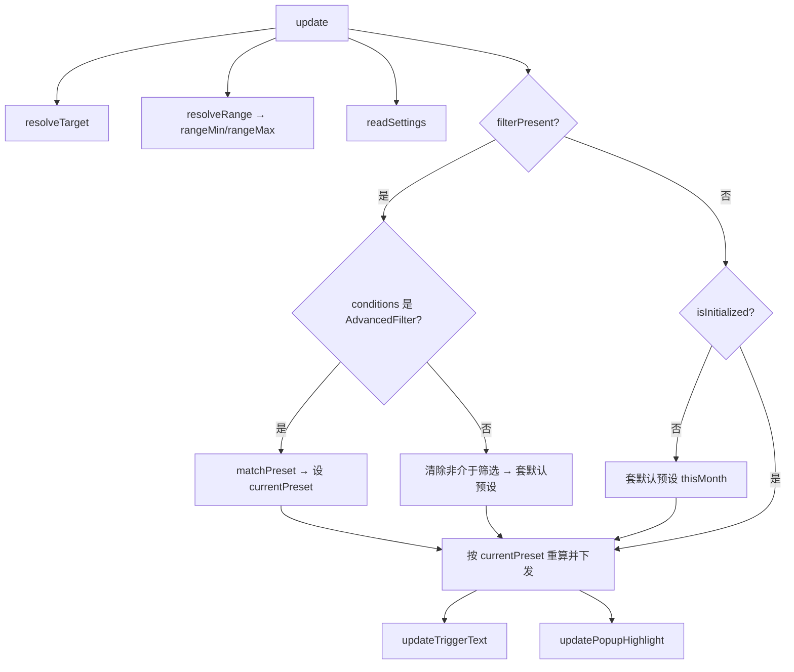

## 产品概述
将现有 DateRangeSlicer（v2.2.1，常驻双日期输入框+默认本月）重构为 v2.3.0，改为**折叠下拉预设选择器**：读取日期字段数据后，根据最大日期（rangeMax）动态生成 5 个预设区间选项（本月/上月/近30天/近15天/近7天），用户点击下拉切换预设，筛选永远跟随最新数据自动重算。

## 核心功能
- 读取日期字段数据，计算 rangeMin / rangeMax
- 根据 rangeMax 生成 5 个预设：本月(MTD)、上月、近30天、近15天、近7天
- 折叠下拉 UI：默认显示当前预设名+下拉箭头，点击展开 5 个选项
- 首载默认套"本月"（[月首, rangeMax]），高亮当前选中项
- 预设永远跟随：每次刷新都按 rangeMax 重算当前预设区间，跨月自动跟进
- 切页恢复：从 jsonFilters 读回区间，匹配最接近的预设并高亮
- 点选项立即下发 AdvancedFilter 筛选并收起下拉
- 点外部/Esc 收起下拉


## Tech Stack
- TypeScript + Power BI Custom Visuals API (~5.4.0)
- powerbi-models (AdvancedFilter)
- Less CSS 预处理器
- Webpack 构建（powerbi-visuals-tools）

## Implementation Approach

### 整体策略
将当前"双 input[type=date] + 叠加层 + userOverridden 冻结逻辑"整体替换为"下拉 trigger + popup + 预设计算 + 永远跟随状态机"。删除所有输入框相关 DOM/事件/样式，新增下拉交互 DOM + CSS + 事件绑定。

### 预设计算逻辑（全部基于 rangeMax 本地时区）
```
本月(MTD):   [new Date(maxY, maxM, 1), rangeMax]
上月:        [new Date(maxY, maxM-1, 1), new Date(maxY, maxM, 0)]
近30天:      [new Date(maxY, maxM, maxD-29), rangeMax]  (需处理跨月)
近15天:      [new Date(maxY, maxM, maxD-14), rangeMax]
近7天:       [new Date(maxY, maxM, maxD-6),  rangeMax]
```
所有日期用 `new Date(y, m, d)` 本地时区构造，序列化时用 `toJSON()`（带本地偏移），与现有 applyBetweenFilter 的时区处理一致。

### 状态机（永远跟随，无冻结）
- 新增字段 `currentPreset: string`（默认 "thisMonth"）
- 每次 update：resolveRange → 按 currentPreset 重算区间 → applyPresetFilter 下发 → 更新 trigger 文本
- 不再需要 userOverridden 标志（但 readSettings 仍读它做兼容，不影响逻辑）
- 切页恢复：从 jsonFilters conditions 反推 [start, end] 区间，匹配最接近的预设并设为 currentPreset

### 下拉交互（关键决策）
- popup 作为视觉自身 DOM 子元素（不挂 document.body），避免 sandboxed iframe 截断
- trigger click → toggle popup 显隐 + stopPropagation
- 选项 click → 设 currentPreset + applyPresetFilter + 收起 popup
- document click 监听 → 点外部收起 popup
- Esc key 监听 → 收起 popup
- 移除时清理 document 级监听器（destroy 时）

### 筛选下发（复用现有时区逻辑）
- 开始日期：`new Date(y, m, d).toJSON()` → GreaterThanOrEqual
- 结束日期：`new Date(y, m, d+1).toJSON()` → LessThan（次日零点，语义=包含当天）
- 与现有 applyBetweenFilter 完全一致的时区处理

### 性能与可靠性
- resolveRange 已有 O(n) 遍历，30000 上限不变
- 预设计算是 O(1) 日期运算，无性能瓶颈
- 切页恢复匹配：遍历 5 个预设计算区间，找 start/end 误差最小的，O(5) 常数级
- document click 监听用 capture 阶段 + stopPropagation 避免误触发

## Architecture Design



## Directory Structure Summary
本版本是重构，涉及 4 个核心文件修改 + 1 个 CHANGELOG 追加。所有改动集中在 DateRangeSlicer 目录内。

```
visual/DateRangeSlicer/
├── src/
│   └── visual.ts          # [MODIFY] 重写：删输入框，加下拉 trigger+popup+预设计算+永远跟随
├── style/
│   └── dateRangeSlicer.less  # [MODIFY] 删输入框样式，加下拉 trigger/popup/选项样式
├── capabilities.json      # [MODIFY] 删 style/labels 对象，selection 改名，defaultBehavior 保留
├── pbiviz.json             # [MODIFY] version→2.3.0.0，description 更新
└── CHANGELOG.md            # [MODIFY] 追加 v2.3.0.0 条目
```

### 文件详细说明

**src/visual.ts [MODIFY]**
- 删除字段：startEl, endEl, startWrap, endWrap, startValueEl, endValueEl, inputsEl, startActive, endActive, style, lastFilterPresent, isInitialized（语义变化）
- 新增字段：triggerEl(HTMLElement), arrowEl(HTMLElement), popupEl(HTMLElement), currentPreset(string), isPopupOpen(boolean), docClickHandler(Function)
- 删除方法：updateValueDisplay, restoreFilter, applyInitialDefault, parseInputDate, onChange 闭包
- 新增方法：
  - `computePresetRange(preset: string): { start: Date, end: Date } | null` — 按 rangeMax 计算预设区间
  - `applyPresetFilter(preset: string): void` — 计算区间 + 下发 AdvancedFilter + 更新 trigger 文本
  - `matchPreset(filter: any): string | null` — 从 jsonFilters conditions 反推区间，匹配最接近的预设
  - `togglePopup(open?: boolean): void` — 开关 popup + 绑定/解绑 document click
  - `updatePopupHighlight(): void` — 高亮当前 currentPreset 选项
  - `onDocClick(e: MouseEvent): void` — 点外部收起 popup
- 修改方法：
  - constructor：删输入框 DOM 创建，改为创建 trigger + arrow + popup + 5 个选项 div，绑定事件
  - update：简化为 resolveTarget → readSettings → applyStyles → resolveRange → 预设套用/恢复逻辑
  - getFormattingModel：删 labels 卡片，selection 改名"下拉样式"，defaultBehavior 保留
  - applyStyles：CSS 变量绑定改为 trigger/popup 元素
  - readSettings：保留 userOverridden 读取（兼容），currentPreset 从 state 对象读取（新增持久化）
  - resolveRange：删 input min/max 设置，保留 rangeMin/rangeMax 计算 + tooltip

**style/dateRangeSlicer.less [MODIFY]**
- 删除：.drs-inputs, .drs-input-wrap, .drs-value, .drs-input, .drs-arrow 及子规则
- 新增：
  - `.drs-trigger`：下拉触发器样式（背景/边框/圆角/字体，复用 selection CSS 变量）
  - `.drs-trigger:hover` / `.drs-trigger.active`：悬停/展开态
  - `.drs-trigger-text`：预设名文本
  - `.drs-trigger-arrow`：下拉箭头（CSS 三角或文字 ▼）
  - `.drs-popup`：弹出层（绝对定位、背景/边框/阴影）
  - `.drs-option`：选项行（padding/hover/字体）
  - `.drs-option.active`：选中高亮（accent 色）
  - `.drs-option-dot`：选中圆点

**capabilities.json [MODIFY]**
- 删除对象：`style`（固定下拉模式，不再需要枚举）
- 删除对象：`labels`（下拉文本用 selection 颜色）
- 保留对象：`header`（标头样式不变）、`selection`（改 displayName 为"下拉样式"）、`defaultBehavior`（defaultThisMonth 保留）、`state`（新增 currentPreset 属性持久化）
- selection 中删除废弃属性：singleSelect, ctrlMultiSelect, showSelectAll
- state 对象新增：`currentPreset`（text 类型，持久化当前预设名）

**pbiviz.json [MODIFY]**
- version: "2.2.1.0" → "2.3.0.0"
- description: 更新为"折叠下拉预设选择器，5 个动态预设（本月/上月/近30天/近15天/近7天），永远跟随最新数据"

**CHANGELOG.md [MODIFY]**
- 头部追加 v2.3.0.0 条目

## Implementation Notes
- 时区处理：所有预设计算用 `new Date(y, m, d)` 本地时区构造，序列化用 `toJSON()`，与现有 applyBetweenFilter 完全一致，避免 UTC 偏移导致日期错位
- document click 监听：用 capture 阶段（`addEventListener("click", handler, true)`），在 trigger 的 click 冒泡前拦截，避免"点 trigger 打开 → document 立即关闭"的死循环
- popup 定位：`position: absolute` 相对于 `.dateRangeSlicer` root（root 需 `position: relative`），不挂 document.body 避免 sandboxed iframe 截断
- 切页恢复匹配精度：日期比较到天级（忽略时分秒），找 start/end 误差天数之和最小的预设；若无任何匹配（误差>3天），保持当前 currentPreset 不变
- 向后兼容：readSettings 仍读 userOverridden（旧报表持久化的值），但新逻辑不再用它做分流；currentPreset 新增持久化，旧报表无此属性时默认 "thisMonth"
- persistProperties：currentPreset 变更时调用 `host.persistProperties` 写回 state.currentPreset，重开报表恢复用户上次选的预设


## 设计风格
采用深色暗蓝主题，与现有 Power BI 报表整体风格一致。下拉触发器为深色圆角胶囊按钮，展开后弹出层为更深的暗蓝面板，选中项用主题蓝高亮。整体紧凑、精致、企业级仪表盘风格。

## 布局结构
- 标头行（可选）：左侧标题文字
- 下拉触发器：横向占满或自适应宽度，显示当前预设名 + 右侧下拉箭头
- 弹出层：覆盖在触发器下方，5 个选项纵向排列，选中项左侧有圆点高亮

## 关键尺寸
- 触发器高度：30px（与原标头一致）
- 弹出层宽度：与触发器等宽
- 选项高度：28px
- 圆角：复用 selection.borderRadius（默认 3px）
- 内边距：选项左右 8px

## Agent Extensions
### SubAgent
- **code-explorer**
  - Purpose: 在实施阶段快速搜索/确认 Power BI Visuals API 的 persistProperties、applyJsonFilter、AdvancedFilter 等接口签名，确保调用正确
  - Expected outcome: 确认 API 签名匹配，避免运行时类型错误
