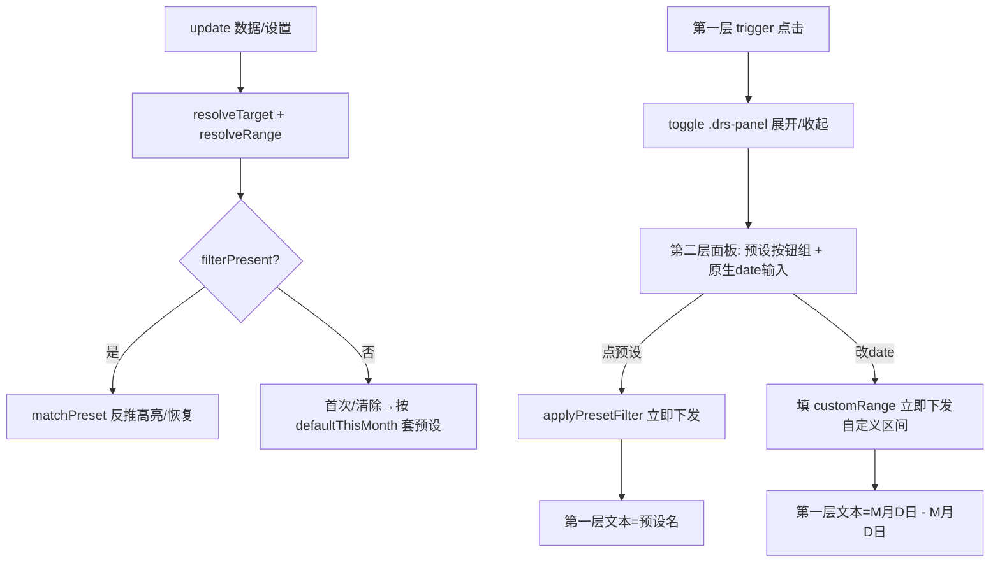

## 用户需求
将 DateRangeSlicer 自定义视觉改造为「三层折叠面板」日期区间选择器，视觉内展开占据区域（非浮层，避开 sandboxed iframe 裁切）。

## 产品概述
视觉常驻一个触发器输入框，点击向下展开面板。面板内含预设按钮组与原生日期输入框，支持预设快速套用与自定义任意区间。选预设或选完自定义日期均立即下发筛选，无应用按钮、无刷新。

## 核心功能
- 第一层单一输入框：常驻显示当前选中值。选预设显示预设名（如"本月"）；自定义区间显示"M月D日 - M月D日"格式（如"8月8日 - 8月10日"）。带下拉箭头，点击展开/收起面板。
- 第二层展开面板（视觉内占据区域）：上半部两列预设按钮组（本月/上月/近7天/近15天/近30天）；下半部开始日期、结束日期两个原生日历输入框（input[type=date]，可弹出系统日期选择器）。
- 第三层自定义日期：通过原生输入框弹出系统日历选开始/结束日期，选完即突破预设固定区间，形成任意区间。
- 下发行为：选预设立即下发 AdvancedFilter；自定义区间在选完结束日期后立即下发。无应用按钮、不刷新。
- 持久化：自定义区间与当前预设写入 capabilities，重开报表恢复。


## 技术栈选择
- 沿用现有项目栈：Power BI 自定义视觉（powerbi-visuals-api + powerbi-models AdvancedFilter），TypeScript，LESS 样式，pbiviz 构建（项目内 node_modules/powerbi-visuals-tools + managed node v22.22.2）。
- 版本升至 v2.4.0.0，GUID 保持不变（`DateRangeSlicer20260825004`）以支持热升级。

## 实现方案
**策略**：在现有 v2.2 简版代码基础上重构 DOM 结构与状态模型，将"触发器+absolute 浮层"改为"触发器+视觉内展开面板"，复用已有的预设区间计算与筛选下发逻辑，新增原生 date 输入与自定义区间状态。

**关键决策**：
1. **面板视觉内展开**：`.drs-panel` 用 `display` 切换（block/none），作为 root 子元素正常文档流向下撑高，不挂 `document.body`、不用 `position:absolute`，彻底规避 sandboxed iframe 弹层裁切（记忆 line 18 已验证浮层不可行）。
2. **原生 input[type=date]**：用户明确要求，系统日历由浏览器绘制可飞出 iframe；自定义深色化通过 `::-webkit-calendar-picker-indicator` 反色 + 深色背景实现，复用 `--drs-*` 变量保持主题一致。
3. **状态并存模型**：`currentPreset`（预设键）与 `customRange{start,end}` 并存。选预设→清空 customRange、立即 `applyPresetFilter`；改 date→填 customRange、立即下发自定义 AdvancedFilter。第一层文本由二者派生。
4. **复用核心逻辑**：`resolveTarget`/`resolveRange`/`parseDate`/`computePresetRange`/`applyPresetFilter`/`matchPreset`/`persistCurrentPreset` 全部保留复用；`applyPresetFilter` 增加自定义区间分支。

**性能与可靠性**：
- 筛选下发沿用现有 GreaterThanOrEqual(start 午夜)/LessThan(end+1 零点) 逻辑，时间复杂度 O(1)，无额外遍历。
- `resolveRange` 每次 update 重算数据 min/max（O(n), n≤30000），沿用现有上限保护，避免 N+1。
- document click 监听用 capture 阶段、在面板展开时绑定、收起时解绑（沿用现有 `docClickHandler`/`keyHandler` 模式），避免内存泄漏。

## 实现要点（防回归）
- 保留 `defaultThisMonth` 开关与"首次加载套本月"逻辑，自定义区间不触发该逻辑。
- 保留 `matchPreset`（切页恢复反推预设高亮），自定义区间（误差>3天）不匹配预设时显示为自定义文本。
- 保留 `persistCurrentPreset` 持久化；新增 `customStart`/`customEnd` 持久化。
- 原生 date 的 `change` 事件需做空值/顺序校验（结束<开始则交换或 clamp），避免非法 AdvancedFilter。
- 删除现有 `popupEl` absolute 浮层相关样式与翻转逻辑（`drs-popup-up` 等），改为面板展开样式。

## 架构设计


## 目录结构
```
visual/DateRangeSlicer/
├── src/visual.ts              # [MODIFY] 重构 DOM：trigger(单层) + panel(预设网格 + 两个 input[type=date])；新增 customRange 状态、原生 date change 处理、第一层标签派生(预设名/自定义文本)；复用并扩展 applyPresetFilter/matchPreset/persistCurrentPreset；删除 absolute popup 逻辑。
├── style/dateRangeSlicer.less # [MODIFY] 删除 .drs-popup absolute 浮层样式；新增 .drs-panel(视觉内展开占据区域)、.drs-preset-grid(两列按钮)、.drs-date-input(原生 date 深色化) 样式；复用 --drs-* 主题变量。
├── capabilities.json         # [MODIFY] objects 新增 customRange object(customStart/customEnd ISO 文本属性)用于持久化；保留 header/selection/defaultBehavior/state。
└── pbiviz.json               # [MODIFY] version 改为 2.4.0.0，description 更新为三层折叠面板说明，GUID 不变。
```

## 关键代码结构
```typescript
// 状态补充（在 DateRangeSlicer 类内）
private customRange: { start: Date | null; end: Date | null } = { start: null, end: null };

// 第一层标签派生
private deriveTriggerLabel(): string {
  if (this.customRange.start && this.customRange.end) {
    const f = (d: Date) => `${d.getMonth() + 1}月${d.getDate()}日`;
    return `${f(this.customRange.start)} - ${f(this.customRange.end)}`;
  }
  return this.presetName(this.currentPreset);
}

// 原生 date 变更 → 自定义区间下发
private onCustomDateChange(): void {
  const s = this.parseDate(this.startInput.value);
  const e = this.parseDate(this.endInput.value);
  if (!s || !e) return;
  if (e < s) { /* clamp 或交换 */ }
  this.customRange = { start: s, end: e };
  this.applyCustomFilter(s, e);
}
```


## 设计风格
采用深蓝暗色主题（对齐 PBI 主题 PBI-Style-深蓝暗色），卡片底 #142436、边框 #2C4A6B、强调 #378ADD、文字 #B4B2A9、面板底 #0A1428。第一层触发器为深色圆角输入框带下拉箭头与 hover 强调色描边；展开面板为视觉内向下延伸的深色卡片，预设按钮两列网格（选中态强调色描边+微光），原生日期输入框深色化（日历图标反色）。整体紧凑、无浮层、与 PBI 画布融合。

## 页面区块（单视觉内）
- 第一层触发器块：常驻单行，左文本右箭头，圆角 3px，点击展开。
- 面板块：展开后占据区域，上部预设按钮组（两列），下部开始/结束原生日期输入（同行或堆叠）。
- 选中反馈：预设选中态左侧圆点+强调色文字+边框微光；自定义区间时两个 date 输入框均强调色描边。
